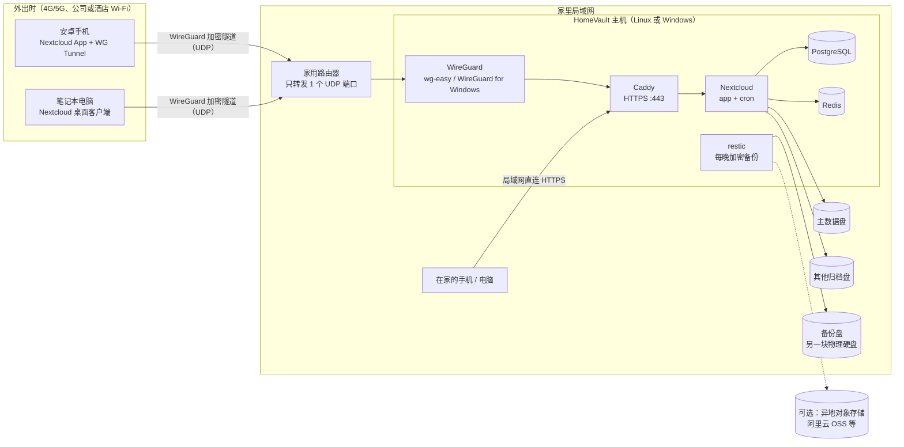

# HomeVault 家庭归档服务器

**一句话：** HomeVault 是一套部署工具包，把家里一台装有几块硬盘、有公网 IPv4 的电脑（Linux 或 Windows）变成**只能通过 VPN 访问**的私有 Nextcloud 归档服务器。全家的安卓手机无论在家还是在外面，都能**自动备份**照片和视频。

> HomeVault 不自己开发服务器软件。它把 Nextcloud、WireGuard、Caddy、PostgreSQL、Redis、restic、ddns-go 这些成熟的开源项目，按照安全的默认配置组合起来。另外提供一个管理命令（Linux 上是 `./hv`，Windows 上是 `.\windows\hv.ps1`），把安装、体检、备份、升级这些事情变成一条条命令。

---

## 为什么用成熟的开源项目搭建

自己写的服务器程序很难做到长期安全、长期维护。HomeVault 只做"胶水"：配置文件、脚本和中文文档。真正保存数据、加密通信的，都是有大量用户、持续维护的开源项目：

| 组件 | 在 HomeVault 里的作用 | 项目主页 |
|---|---|---|
| [Nextcloud](https://nextcloud.com/)（官方 Docker 镜像，34 版） | 文件存储、网页界面、安卓/电脑客户端、通讯录和日历（CardDAV/CalDAV） | <https://github.com/nextcloud/server> · <https://github.com/nextcloud/docker> |
| [WireGuard](https://www.wireguard.com/) | 加密 VPN 隧道，是外网进入家里的唯一入口 | <https://www.wireguard.com/> |
| [wg-easy](https://github.com/wg-easy/wg-easy)（v15，仅 Linux） | 带网页管理界面的 WireGuard 服务端 | <https://github.com/wg-easy/wg-easy> |
| [WireGuard for Windows](https://github.com/WireGuard/wireguard-windows)（仅 Windows） | Windows 上的 WireGuard 服务端（开机即运行的隧道服务） | <https://github.com/WireGuard/wireguard-windows> |
| [Caddy](https://caddyserver.com/)（2.11） | HTTPS 反向代理、自动证书（内置本地 CA 或 Let's Encrypt） | <https://github.com/caddyserver/caddy> |
| [PostgreSQL](https://www.postgresql.org/)（18） | Nextcloud 的数据库 | <https://www.postgresql.org/> |
| [Redis](https://redis.io/)（8） | 缓存和文件锁 | <https://redis.io/> |
| [restic](https://restic.net/)（0.19） | 加密、去重的增量备份 | <https://github.com/restic/restic> |
| [ddns-go](https://github.com/jeessy2/ddns-go)（可选） | 动态域名解析（DDNS），让手机随时找到家里变化的公网 IP | <https://github.com/jeessy2/ddns-go> |
| [Scrutiny](https://github.com/AnalogJ/scrutiny)（可选，仅 Linux） | 硬盘 SMART 健康监控 | <https://github.com/AnalogJ/scrutiny> |

感谢以上项目的作者和社区。第三方组件的许可证见 [THIRD_PARTY_NOTICES.md](THIRD_PARTY_NOTICES.md)。

---

## 架构一览



看不到上图时，可以看这张纯文本版：

```text
 Outside (4G/5G)              Home LAN
+-----------------+        +--------------+        +------------------ HomeVault PC ------------------+
| Android phone   |  UDP   |    Router    |  UDP   |                                                  |
| Nextcloud app   |=======>| forwards ONE |=======>| WireGuard --> Caddy --> Nextcloud --+--> data disk |
| + WireGuard     |WG_PORT | UDP port     |        | (wg-easy /    HTTPS     app + cron   +--> extra disks|
+-----------------+        +--------------+        |  WG for Win)   ^           |                        |
                                                   |                |      PostgreSQL, Redis             |
 Phone / PC at home ------- LAN, HTTPS ------------+----------------+                                    |
                                                   | restic (nightly, encrypted) --> backup disk / S3   |
                                                   +----------------------------------------------------+
```

图例：外出时，手机先通过 WireGuard 隧道（路由器上唯一开放的 UDP 端口）回到家里，再访问 Caddy 提供的 HTTPS 地址。在家时，手机直接在局域网里访问**同一个地址**。Caddy 把请求转给 Nextcloud，Nextcloud 把文件写到你选定的硬盘上。restic 每晚把数据加密备份到另一块硬盘，也可以同时备份到异地。

**关键设计：全家只用一个固定地址。** 手机 App 里填写的服务器地址永远是 `https://<主机局域网IP>`（IP 模式），或 `https://<你的域名>`（域名模式，域名解析到局域网 IP）。在家直接连，出门自动走 VPN，App 设置不用改。详见 [docs/01-架构与安全.md](docs/01-架构与安全.md)。

---

## 功能

### 核心：安卓手机自动备份

- 使用官方 **Nextcloud 安卓 App** 的"自动上传"：相机照片、截图、微信图片等任意文件夹，拍完自动传回家。可以设置"仅在不按流量计费的 Wi-Fi 下上传""仅在充电时上传"。
- **在外面也能备份**：推荐用 **WG Tunnel** App。它按 Wi-Fi 名称自动开关 VPN，家里公网 IP 变了也能自动跟上。官方 WireGuard App 也能用。
- **大视频没问题**：服务器接受分块上传的多 GB 视频，不设请求体大小上限，超时时间也足够长。
- **每台设备一个独立的应用密码**：手机丢了，只要撤销这台手机的密码，不影响其他设备。
- **通讯录和日历**：配合 DAVx⁵ 同步到自己家里的服务器。
- 针对国产手机"杀后台"，文档按品牌写了自启动和省电设置。详见 [docs/05-安卓手机备份.md](docs/05-安卓手机备份.md)。

### 家庭归档

- **多块硬盘**：一块作为主数据盘，其他硬盘（例如已有的照片、影视资料盘）可以按"只读"或"读写"挂进 Nextcloud，并按用户或群组控制谁能看到。
- **家庭成员账户**：每人一个账户，可以设配额，例如 `--quota 500GB`。
- **电脑也能用**：Nextcloud 桌面客户端（支持虚拟文件，不占本地空间）、WebDAV、rclone。详见 [docs/06-电脑使用.md](docs/06-电脑使用.md)。
- **自动备份**：restic 每晚加密增量备份到另一块硬盘，可选同时备份到阿里云 OSS 等 S3 兼容存储。支持单个文件恢复和整机灾难恢复。详见 [docs/07-备份与恢复.md](docs/07-备份与恢复.md)。
- **一条命令体检**：`doctor` 会逐项检查容器状态、端口绑定、防火墙、二步验证、证书、剩余空间、上次备份时间等，结果用 ✔/✘ 标出。

### 安全要点

| 措施 | 说明 |
|---|---|
| **只开放一个 UDP 端口** | 路由器上只转发 WireGuard 的 UDP 端口（建议 20000–60000 之间的随机端口）。网页、数据库、管理界面在公网上都**看不到**。 |
| **只监听 IPv4、只绑定指定地址** | 发布的端口都显式绑定 IPv4 地址，避免国内宽带普遍下发的 IPv6 公网地址把服务意外暴露出去。 |
| **强制二步验证** | 所有 Nextcloud 账户必须启用 TOTP 二步验证；客户端只能用应用密码登录（`token_auth_enforced`）。 |
| **全程 HTTPS** | 默认使用 Caddy 内置的本地 CA 签发证书；如果你有域名，可以用 Let's Encrypt 的 DNS 验证方式申请正式证书。 |
| **VPN 默认只能访问这台主机** | 手机的 VPN 密钥即使泄露，也进不了家里的路由器、NAS 等其他设备。 |
| **多层防护** | 主机防火墙、Caddy 来源地址白名单、Nextcloud 暴力破解防护、审计日志、容器加固。 |
| **备份加密** | restic 仓库有密码保护。安装结束时只显示一次密码，需要离线保存。 |
| **密钥不落在命令行里** | 所有密码随机生成，每个密码单独存成一个文件，通过 `_FILE` 方式传给容器，`docker inspect` 看不到。 |

完整的威胁模型，以及 HomeVault **不能**防护的情况，见 [docs/01-架构与安全.md](docs/01-架构与安全.md)。

---

## 硬件和系统要求

| 项目 | 要求 / 建议 |
|---|---|
| 电脑 | 一台可以 24 小时开机的 64 位（x86-64）电脑。旧台式机、迷你主机都可以。 |
| 内存 | Linux 建议 ≥ 4 GB；Windows（Docker Desktop + WSL2）建议 ≥ 16 GB。 |
| 系统盘 | 建议用 SSD。Linux 上数据库等程序数据默认放在这里。 |
| 数据盘 | 至少一块大容量硬盘（例如 2 TB 以上）放照片和视频。 |
| 备份盘 | **强烈建议**再准备一块**不同的物理硬盘**做备份（内置或 USB 都行）。 |
| 操作系统 | **Linux**：Debian 或 Ubuntu（需要 Docker Engine ≥ 28、Compose 插件 ≥ 2.24）。**Windows**：Windows 11（推荐）或 Windows 10，需要 Docker Desktop ≥ 4.92（WSL2 后端）和 WireGuard for Windows。 |
| 网络 | 宽带有**公网 IPv4**（动态 IP 也可以，配合 DDNS），并且可以在路由器上设置 UDP 端口转发。没有公网 IPv4 的情况见 [docs/04-VPN与DDNS.md](docs/04-VPN与DDNS.md)。 |
| 手机 | Android 9 或更高版本（Nextcloud App 35.0.0 的最低要求）。 |

> ⚠️ **Windows 10 快要彻底停止支持了。** 它已在 2025-10-14 结束支持，面向个人用户的扩展安全更新（ESU）将在 **2026-10-13** 结束。Docker 只支持仍在微软服务期内的 Windows 版本。新部署请直接用 Windows 11 或 Linux。

---

## 5 分钟快速开始

下面是最短路径。第一次部署建议照着对应平台的详细文档一步步做。

### Linux（Debian / Ubuntu）

先装好 Docker CE 和 Compose 插件（国内可以用阿里云镜像源，见 [docs/02-Linux部署.md](docs/02-Linux部署.md)），把数据盘挂载好，然后：

```bash
# 1. 获取 HomeVault（放在一个固定位置，以后不要随意移动）
sudo git clone <仓库地址> /opt/homevault
cd /opt/homevault

# 2. 交互式安装：检查环境、选择硬盘、生成密钥、启动服务、初始化 VPN
#    国内网络无法访问 Docker Hub 时，加上 --mirror 参数（见 02 文档）
sudo ./hv install

# 3. 启用主机防火墙规则（只允许局域网和 VPN 访问网页端口）
sudo ./hv firewall --apply

# 4. 安排每晚自动备份（默认 03:30）
sudo ./hv schedule-backup

# 5. 体检：所有项目应显示 ✔
sudo ./hv doctor
```

最后在路由器上添加一条端口转发：**UDP `WG_PORT` → 主机局域网 IP**（安装结束时会显示具体端口）。

### Windows 10/11

1. 安装 **Docker Desktop ≥ 4.92**（使用 WSL2）和 **WireGuard for Windows**。在 Docker Desktop 设置里勾选 "Start Docker Desktop when you sign in to your computer"。
2. 把 HomeVault 放到一个固定目录，例如 `C:\Tools\homevault`。
3. 用**管理员身份**打开 PowerShell：

```powershell
cd C:\Tools\homevault
# 只对当前窗口放开脚本执行限制，并解除"从网上下载"的标记
Set-ExecutionPolicy -Scope Process -ExecutionPolicy Bypass -Force
Get-ChildItem -Recurse | Unblock-File

# 交互式安装：选择硬盘、生成密钥、启动服务、配置 WireGuard 隧道服务、自动登录和锁屏任务
.\windows\hv.ps1 install

# 配置 Windows 防火墙规则
.\windows\hv.ps1 firewall

# 添加第一台手机的 VPN 配置（会在浏览器里显示二维码）
.\windows\hv.ps1 vpn add

# 体检
.\windows\hv.ps1 doctor
```

4. 在路由器上转发 **UDP `WG_PORT` → 这台电脑的局域网 IP**。

自动登录、锁屏、电源设置、硬盘选择等细节见 [docs/03-Windows部署.md](docs/03-Windows部署.md)。

### 手机上（两个平台相同）

1. 安装 **Nextcloud** App（GitHub 发布页或 F-Droid）和 **WG Tunnel**（或官方 WireGuard App）。
2. 扫描 VPN 二维码导入隧道配置。
3. IP 模式下，先在手机上安装 HomeVault 的根证书（用 `ca` 命令导出）。
4. 在 Nextcloud App 里登录 `https://<服务器地址>`，打开"自动上传"。

每一步的截图级说明见 [docs/05-安卓手机备份.md](docs/05-安卓手机备份.md)。

> ⚠️ 安装结束时，屏幕上会**只显示一次** Nextcloud 管理员密码和 restic 备份密码。请立即抄在纸上或存进密码管理器。**丢了 restic 密码，备份就再也打不开了。**

---

## 文档目录

| 文档 | 内容 |
|---|---|
| [docs/01-架构与安全.md](docs/01-架构与安全.md) | 整体架构、威胁模型、每一层安全措施、TLS 两种模式、磁盘加密、HomeVault 不能防护什么 |
| [docs/02-Linux部署.md](docs/02-Linux部署.md) | Debian/Ubuntu 上从零部署：安装 Docker、挂载硬盘、`./hv install` 每一步、防火墙、端口转发、首次登录 |
| [docs/03-Windows部署.md](docs/03-Windows部署.md) | Windows 10/11 上部署：Docker Desktop、选择硬盘、开机自启链、电源和防火墙、Hyper-V 替代方案 |
| [docs/04-VPN与DDNS.md](docs/04-VPN与DDNS.md) | 确认公网 IP、路由器 UDP 转发、DDNS、wg-easy / Windows WireGuard、NAT 回流、网段冲突、没有公网 IP 时的替代方案 |
| [docs/05-安卓手机备份.md](docs/05-安卓手机备份.md) | **最重要的一篇**：手机一步步设置、自动上传、WG Tunnel、证书安装、各品牌防杀后台、DAVx⁵、排错 |
| [docs/06-电脑使用.md](docs/06-电脑使用.md) | Nextcloud 桌面客户端（虚拟文件）、WebDAV、rclone |
| [docs/07-备份与恢复.md](docs/07-备份与恢复.md) | restic 备份原理、异地备份、单文件恢复、整机灾难恢复 |
| [docs/08-日常运维与升级.md](docs/08-日常运维与升级.md) | 日/周/月检查清单、升级 Nextcloud、证书、硬盘健康、增减硬盘、更换 IP 或域名、轮换密钥、手机丢失怎么办 |
| [docs/09-常见问题.md](docs/09-常见问题.md) | 常见问题和故障排查 |

---

## 常见问题（节选）

**问：一定要有公网 IPv4 吗？**
答：外出时想要直连回家，需要公网 IPv4（动态的也可以）。可以打电话给运营商申请。实在拿不到时，可以考虑 Tailscale / ZeroTier 等替代方案，见 [docs/04-VPN与DDNS.md](docs/04-VPN与DDNS.md)。

**问：为什么不直接把 Nextcloud 开放到公网，省掉 VPN？**
答：国内家庭宽带通常封锁入站的 80/443 端口，而且家用服务器直接暴露在公网上风险很大。只开放一个 WireGuard UDP 端口时，没有正确密钥的人连"这里有服务"都探测不到。

**问：手机不在家时也会自动备份吗？**
答：会。只要 VPN（推荐 WG Tunnel，可按 Wi-Fi 自动开关）处于连接状态，Nextcloud App 就会照常上传。你也可以设置成只在 Wi-Fi 下上传。

**问：华为 HarmonyOS NEXT 手机能用吗？**
答：HarmonyOS NEXT 不能运行安卓 APK，所以 Nextcloud 和 WireGuard 安卓 App 都装不了，只能通过网页或 WebDAV 访问。详见 [docs/05-安卓手机备份.md](docs/05-安卓手机备份.md)。

**问：Linux 和 Windows 该选哪个？**
答：条件允许时优先选 **Linux**：开机不需要登录、WireGuard 在内核里运行、没有 NTFS 相关的限制。Windows 版适合"这台电脑平时还要当 Windows 用"的情况。

更多问题见 [docs/09-常见问题.md](docs/09-常见问题.md)。

---

## 许可证

HomeVault 自身的代码和文档使用 [MIT 许可证](LICENSE)。

HomeVault 通过 Docker 镜像或官方安装包使用上文列出的第三方项目，这些项目分别遵循各自的许可证（例如 Nextcloud 为 AGPL-3.0）。`windows/vendor/qrcode.js` 是 Kazuhiko Arase 的 [qrcode-generator](https://github.com/kazuhikoarase/qrcode-generator) 2.0.4（MIT）。详见 [THIRD_PARTY_NOTICES.md](THIRD_PARTY_NOTICES.md)。

---

## 来源 / 参考

以下版本号截至 2026-09：

- Nextcloud Docker 官方镜像与标签（34 = stable，35 = latest）：<https://github.com/nextcloud/docker> · <https://hub.docker.com/_/nextcloud>
- Nextcloud 34 系统要求（PostgreSQL 14–18）：<https://docs.nextcloud.com/server/34/admin_manual/installation/system_requirements.html>
- Nextcloud 安卓 App 35.0.0（Android 9+）：<https://github.com/nextcloud/android/releases>
- wg-easy v15.4.0：<https://github.com/wg-easy/wg-easy>
- WireGuard for Windows：<https://github.com/WireGuard/wireguard-windows>
- WG Tunnel：<https://github.com/wgtunnel/android>
- Caddy 2.11.4：<https://caddyserver.com/docs/>
- restic 0.19.1：<https://restic.readthedocs.io/>
- ddns-go v6.17.7：<https://github.com/jeessy2/ddns-go>
- Scrutiny v0.9.4：<https://github.com/AnalogJ/scrutiny>
- Docker Desktop 4.92.0 发布说明：<https://docs.docker.com/desktop/release-notes/>
- Docker 端口发布与防火墙：<https://docs.docker.com/engine/network/port-publishing/> · <https://docs.docker.com/engine/network/packet-filtering-firewalls/>
