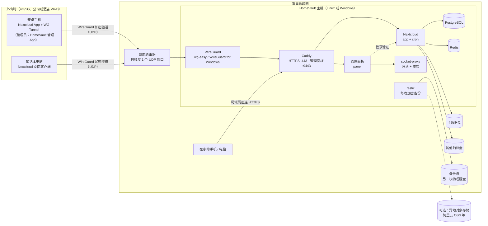

# HomeVault 家庭归档服务器

**一句话：** HomeVault 是一套部署工具包，把家里一台装有几块硬盘、有公网 IPv4 的电脑（Linux 或 Windows）变成**只能通过 VPN 访问**的私有 Nextcloud 归档服务器。全家的安卓手机无论在家还是在外面，都能**自动备份**照片和视频。管理员还可以用手机上的**管理 App**随时查看服务器状态、硬盘、备份和日志。

> HomeVault 不自己开发存储和加密这类核心软件。它把 Nextcloud、WireGuard、Caddy、PostgreSQL、Redis、restic、ddns-go 这些成熟的开源项目，按照安全的默认配置组合起来。另外提供：
> - 一个管理命令：Linux 上是 `./hv`，Windows 上是 `.\windows\hv.ps1`，把安装、体检、备份、升级这些事情变成一条条命令；Windows 上还有**双击安装**和**数字菜单**；
> - 一个很小的**管理面板**（网页）和配套的**安卓管理 App**，只用来"看"和做几件常用操作。

---

## 为什么用成熟的开源项目搭建

自己写的服务器程序很难做到长期安全、长期维护。HomeVault 只做"胶水"：配置文件、脚本、中文文档，加上一个功能很少、权限很小的管理面板。真正保存数据、加密通信的，都是有大量用户、持续维护的开源项目：

| 组件 | 在 HomeVault 里的作用 | 项目主页 |
|---|---|---|
| [Nextcloud](https://nextcloud.com/)（官方 Docker 镜像，34 版） | 文件存储、网页界面、安卓/电脑客户端、通讯录和日历（CardDAV/CalDAV） | <https://github.com/nextcloud/server> · <https://github.com/nextcloud/docker> |
| [WireGuard](https://www.wireguard.com/) | 加密 VPN 隧道，是外网进入家里的唯一入口 | <https://www.wireguard.com/> |
| [wg-easy](https://github.com/wg-easy/wg-easy)（v15，仅 Linux） | 带网页管理界面的 WireGuard 服务端 | <https://github.com/wg-easy/wg-easy> |
| [WireGuard for Windows](https://github.com/WireGuard/wireguard-windows)（仅 Windows） | Windows 上的 WireGuard 服务端（开机即运行的隧道服务） | <https://github.com/WireGuard/wireguard-windows> |
| [Caddy](https://caddyserver.com/)（2.11） | HTTPS 反向代理、自动证书（内置本地 CA 或 Let's Encrypt） | <https://github.com/caddyserver/caddy> |
| [PostgreSQL](https://www.postgresql.org/)（18） | Nextcloud 的数据库 | <https://www.postgresql.org/> |
| [Redis](https://redis.io/)（8） | 缓存和文件锁 | <https://redis.io/> |
| [restic](https://restic.net/)（0.19） | 加密、去重的增量备份 | <https://github.com/restic/restic> |
| [socket-proxy](https://github.com/linuxserver/docker-socket-proxy)（LinuxServer.io） | 给管理面板用的 Docker 接口过滤代理：只放行"查看"和"重启容器" | <https://github.com/linuxserver/docker-socket-proxy> |
| [ddns-go](https://github.com/jeessy2/ddns-go)（可选） | 动态域名（DDNS），让手机随时找到家里变化的公网 IP | <https://github.com/jeessy2/ddns-go> |
| [Scrutiny](https://github.com/AnalogJ/scrutiny)（可选，仅 Linux） | 硬盘 SMART 健康监控 | <https://github.com/AnalogJ/scrutiny> |

感谢以上项目的作者和社区。第三方组件的许可证见 [THIRD_PARTY_NOTICES.md](THIRD_PARTY_NOTICES.md)。

---

## 架构一览



看不到上图时，可以看这张纯文本版：

```text
 Outside (4G/5G)              Home LAN
+-----------------+        +--------------+        +------------------ HomeVault PC ------------------+
| Android phone   |  UDP   |    Router    |  UDP   |                                                  |
| Nextcloud app   |=======>| forwards ONE |=======>| WireGuard --> Caddy --> Nextcloud --+--> data disk |
| + WireGuard     |WG_PORT | UDP port     |        | (wg-easy /    :443     app + cron   +--> extra disks|
| (+ admin app)   |        +--------------+        |  WG for Win)  :9443 --> panel --> socket-proxy     |
+-----------------+                                |                ^      PostgreSQL, Redis             |
 Phone / PC at home ------- LAN, HTTPS ------------+----------------+                                    |
                                                   | restic (nightly, encrypted) --> backup disk / S3   |
                                                   +----------------------------------------------------+
```

图例：外出时，手机先通过 WireGuard 隧道（路由器上唯一开放的 UDP 端口）回到家里，再访问 Caddy 提供的 HTTPS 地址。在家时，手机直接在局域网里访问**同一个地址**。Caddy 把请求转给 Nextcloud，Nextcloud 把文件写到你选定的硬盘上。restic 每晚把数据加密备份到另一块硬盘（或改为备份到云存储）。管理面板用同一个地址的 9443 端口，同样只能在局域网和 VPN 里打开。

**关键设计：全家只用一个固定地址。** 手机 App 里填写的服务器地址永远是 `https://<主机局域网IP>`（IP 模式），或 `https://<你的域名>`（域名模式，域名解析到局域网 IP）。在家直接连，出门自动走 VPN，App 设置不用改。详见 [docs/01-架构与安全.md](docs/01-架构与安全.md)。

---

## 功能

### 核心：安卓手机自动备份

- 使用官方 **Nextcloud 安卓 App** 的"自动上传"：相机照片、截图、微信图片等任意文件夹，拍完自动传回家。可以设置"仅在不按流量计费的 Wi-Fi 下上传""仅在充电时上传"。
- **在外面也能备份**：推荐用 **WG Tunnel** App。它按 Wi-Fi 名称自动开关 VPN，家里公网 IP 变了也能自动跟上。官方 WireGuard App 也能用。
- **大视频没问题**：服务器接受分块上传的多 GB 视频，不设请求体大小上限，超时时间也足够长。
- **每台设备一个独立的应用密码**：手机丢了，只要撤销这台手机的密码，不影响其他设备。
- **通讯录和日历**：配合 DAVx⁵ 同步到自己家里的服务器。
- 针对国产手机"杀后台"，文档按品牌写了自启动和省电设置。详见 [docs/05-安卓手机备份.md](docs/05-安卓手机备份.md)。

### 管理面板 + 安卓管理 App

- **管理面板**：`https://<服务器地址>:9443`，手机和电脑浏览器都能用，中文界面，适配手机屏幕，支持深色模式。
- **安卓管理 App**"HomeVault 家庭归档"：面板的手机外壳，另有"打开 Nextcloud""打开 VPN"快捷按钮。安装包可以从 GitHub Releases 下载，也可以由你自己的服务器提供（面板的"设置"页扫码下载）。
- 能看到：各服务是否正常、每块硬盘的用量、每个家庭成员的用量和配额、备份记录和快照、日志、VPN 设备是否在线；有问题时首页直接列出告警（服务停了、硬盘快满、备份超过 48 小时没成功等）。
- 能做：立即备份、修改日志保留天数、清理旧日志、重启部分服务、下载日志和根证书。
- **只有 Nextcloud 管理员能登录**，走 Nextcloud 自己的登录页，强制二步验证照样生效。面板拿不到 Docker 的完整权限，也不能直接在主机上执行命令。
- 详见 [docs/10-安卓管理App与管理面板.md](docs/10-安卓管理App与管理面板.md)。

### 日志：看得到，按天自动清理

- 所有日志集中在一个目录：Linux 默认 `/srv/homevault/logs`，Windows 默认 `<数据盘>:\HomeVault\logs`（资源管理器里直接能看）。包括管理命令日志、每次备份的日志、Nextcloud 运行日志和审计日志、HTTPS 访问日志、每天导出的容器日志、管理面板操作记录。
- **保留天数你来定**：默认 7 天，可设 1–365 天。安装时会问，以后用 `logs retention <天数>`、Windows 菜单或管理面板随时修改；每天的维护任务自动删除过期日志。
- 查看方式：管理面板的"日志"页（可搜索、下载）、`logs` 命令、Windows 菜单、Nextcloud 管理页面。详见 [docs/08-日常运维与升级.md](docs/08-日常运维与升级.md) §7。

### Windows：双击安装，菜单管理

- **双击 `一键安装.cmd`** 即可安装：自动请求管理员权限；检查 Docker Desktop、WireGuard、Autologon，没装的可以在你确认后用 winget 自动安装；向导问题尽量少，都有默认值，硬盘用盘符选择。
- 装好后浏览器自动打开管理面板，桌面出现"**HomeVault 管理**"快捷方式：双击打开数字菜单（状态、启动、停止、查看日志、日志保留天数、添加手机 VPN、立即备份、存储/硬盘、健康检查、更新、用户管理……），不用记命令。
- 停电、Windows 更新重启后自动恢复：WireGuard 开机即运行，自动登录 + 立即锁屏，Docker Desktop 随登录启动。详见 [docs/03-Windows部署.md](docs/03-Windows部署.md)。

### 家庭归档

- **多块硬盘**：一块作为主数据盘，其他硬盘（例如已有的照片、影视资料盘）可以按"只读"或"读写"挂进 Nextcloud，并按用户或群组控制谁能看到。
- **家庭成员账户**：每人一个账户，可以设配额，例如 `--quota 500GB`。
- **电脑也能用**：Nextcloud 桌面客户端（支持虚拟文件，不占本地空间）、WebDAV、rclone。详见 [docs/06-电脑使用.md](docs/06-电脑使用.md)。
- **自动备份**：restic 每晚加密增量备份到**一个**目标（`HV_BACKUP_TARGET` 二选一）：另一块硬盘，或阿里云 OSS 等 S3 兼容存储。想本地、异地各有一份：两块移动硬盘轮换（一块放在别处），或本地备份后再用 rclone 复制到云上，见 [docs/07-备份与恢复.md](docs/07-备份与恢复.md) §9。支持单个文件恢复和整机灾难恢复。
- **一条命令体检**：`doctor` 会逐项检查容器状态、端口绑定、防火墙、二步验证、证书、剩余空间、上次备份时间等，结果用 ✔/✘ 标出。

### 安全要点

| 措施 | 说明 |
|---|---|
| **只开放一个 UDP 端口** | 路由器上只转发 WireGuard 的 UDP 端口（建议 20000–60000 之间的随机端口）。网页、管理面板、数据库在公网上都**看不到**。 |
| **只监听 IPv4、只绑定指定地址** | 发布的端口都显式绑定 IPv4 地址，避免国内宽带普遍下发的 IPv6 公网地址把服务意外暴露出去。 |
| **强制二步验证** | 所有 Nextcloud 账户必须启用 TOTP 二步验证；客户端只能用应用密码登录（`token_auth_enforced`）。管理面板也用 Nextcloud 登录，同样受二步验证保护。 |
| **全程 HTTPS** | 默认使用 Caddy 内置的本地 CA 签发证书；如果你有域名，可以用 Let's Encrypt 的 DNS 验证方式申请正式证书。 |
| **VPN 默认只能访问这台主机** | 手机的 VPN 密钥即使泄露，也进不了家里的路由器、NAS 等其他设备。 |
| **管理面板权限很小** | 只有 Nextcloud 管理员能登录；面板容器没有 `docker.sock`，只能通过过滤代理查看状态、日志和重启容器；对主机的操作只能提交三种固定的"请求"，由主机检查后执行。 |
| **多层防护** | 主机防火墙、Caddy 来源地址白名单、管理页面（面板 9443、wg-easy 8443）拒绝浏览器跨站写请求、Nextcloud 暴力破解防护、审计日志、容器加固。 |
| **备份加密** | restic 仓库有密码保护。安装结束时只显示一次密码，需要离线保存。 |
| **密钥不落在命令行里** | 所有密码随机生成，每个密码单独存成 `secrets/` 下的一个文件；数据库、Redis、Nextcloud 管理员和 restic 密码通过 `_FILE` 方式传给容器，`docker inspect` 看不到；日志里也不记录密码。 |

完整的威胁模型，以及 HomeVault **不能**防护的情况，见 [docs/01-架构与安全.md](docs/01-架构与安全.md)。

---

## 硬件和系统要求

| 项目 | 要求 / 建议 |
|---|---|
| 电脑 | 一台可以 24 小时开机的 64 位（x86-64）电脑。旧台式机、迷你主机都可以。 |
| 内存 | Linux 建议 ≥ 4 GB；Windows（Docker Desktop + WSL2）建议 ≥ 16 GB。 |
| 系统盘 | 建议用 SSD。Linux 上数据库等程序数据默认放在这里。 |
| 数据盘 | 至少一块大容量硬盘（例如 2 TB 以上）放照片和视频。 |
| 备份盘 | **强烈建议**再准备一块**不同的物理硬盘**做备份（内置或 USB 都行）。 |
| 操作系统 | **Linux**：Debian 或 Ubuntu（需要 Docker Engine ≥ 28、Compose 插件 ≥ 2.24）。**Windows**：Windows 11（推荐）或 Windows 10，需要 Docker Desktop ≥ 4.92（WSL2 后端）和 WireGuard for Windows（一键安装可以帮你装）。 |
| 网络 | 宽带有**公网 IPv4**（动态 IP 也可以，配合 DDNS），并且可以在路由器上设置 UDP 端口转发。没有公网 IPv4 的情况见 [docs/04-VPN与DDNS.md](docs/04-VPN与DDNS.md)。 |
| 手机 | Nextcloud App：Android 9 或更高版本（35.0.0 版的最低要求）。HomeVault 管理 App：Android 8.0 或更高版本。 |

> ⚠️ **Windows 10 快要彻底停止支持了。** 它已在 2025-10-14 结束支持，面向个人用户的扩展安全更新（ESU）将在 **2026-10-13** 结束。Docker 只支持仍在微软服务期内的 Windows 版本。新部署请直接用 Windows 11 或 Linux。

---

## 5 分钟快速开始

下面是最短路径。第一次部署建议照着对应平台的详细文档一步步做。

### Windows 10/11：双击安装

1. 在 GitHub 项目页 <https://github.com/yuelanxian/-> 点 **Code → Download ZIP**。解压前右键 ZIP → **属性** → 勾选"**解除锁定**"。解压到一个固定目录，例如 `C:\Tools\homevault`（不要解压到 `D:\HomeVault` 这类 `<盘符>:\HomeVault` 文件夹，那是安装程序默认的数据目录）。
2. **双击 `一键安装.cmd`**，在"用户账户控制"提示里点**是**。
3. 按向导操作，每个问题直接回车就是默认值：
   - 没装 Docker Desktop、WireGuard、Autologon 时，会问你是否用 winget 自动安装。装完 Docker Desktop 如果要求重启，重启后打开一次 Docker Desktop，再双击 `一键安装.cmd` 继续；
   - 用**盘符**选择主数据盘和备份盘（备份盘最好是另一块物理硬盘）；
   - 设置日志保留天数（默认 7 天）。
4. 安装结束后，浏览器会打开**管理面板**，桌面会出现"**HomeVault 管理**"。以后双击它，用数字菜单管理：例如 **6 添加手机VPN** 生成手机的 VPN 二维码，**13 健康检查** 做体检。
5. 在路由器上转发 **UDP `WG_PORT` → 这台电脑的局域网 IP**（安装总结里会显示具体端口）。

自动登录、锁屏、电源设置、硬盘选择、计划任务等细节见 [docs/03-Windows部署.md](docs/03-Windows部署.md)。

### Linux（Debian / Ubuntu）

先装好 Docker CE 和 Compose 插件（国内可以用阿里云镜像源，见 [docs/02-Linux部署.md](docs/02-Linux部署.md)），把数据盘挂载好，然后：

```bash
# 1. 获取 HomeVault（放在一个固定位置，以后不要随意移动）
sudo git clone https://github.com/yuelanxian/- /opt/homevault
cd /opt/homevault

# 2. 交互式安装：检查环境、选择硬盘、设置日志保留天数、生成密钥、启动服务、初始化 VPN，
#    并（在你确认后）应用主机防火墙、安装每日维护和每晚备份的定时任务
#    国内网络无法访问 Docker Hub 时，加上 --mirror daocloud（见 02 文档）
sudo ./hv install

# 3. 体检：应全部显示 ✔（刚装好时"还没有成功的备份"这类 ! 提示，做完第一次备份就会消失）
sudo ./hv doctor
```

防火墙和定时备份也可以单独（重新）设置：`sudo ./hv firewall --apply`、`sudo ./hv schedule-backup`。

最后在路由器上添加一条端口转发：**UDP `WG_PORT` → 主机局域网 IP**（安装结束时会显示具体端口）。

### 手机上（两个平台相同）

1. 安装 **Nextcloud** App（GitHub 发布页或 F-Droid）和 **WG Tunnel**（或官方 WireGuard App）。
2. 扫描 VPN 二维码导入隧道配置。
3. IP 模式下，先在手机上安装 HomeVault 的根证书（用 `ca` 命令导出，或在家里 Wi-Fi 下从 `https://<服务器地址>:9443/ca.crt` 下载）。
4. 在 Nextcloud App 里登录 `https://<服务器地址>`，打开"自动上传"。
5. （管理员可选）安装 **HomeVault 管理 App**，地址填 `https://<服务器地址>:9443`。

每一步的截图级说明见 [docs/05-安卓手机备份.md](docs/05-安卓手机备份.md) 和 [docs/10-安卓管理App与管理面板.md](docs/10-安卓管理App与管理面板.md)。

> ⚠️ 安装结束时，屏幕上会**只显示一次** Nextcloud 管理员密码和 restic 备份密码。请立即抄在纸上或存进密码管理器。**丢了 restic 密码，备份就再也打不开了。**

---

## 文档目录

| 文档 | 内容 |
|---|---|
| [docs/01-架构与安全.md](docs/01-架构与安全.md) | 整体架构、威胁模型、每一层安全措施、TLS 两种模式、磁盘加密、HomeVault 不能防护什么 |
| [docs/02-Linux部署.md](docs/02-Linux部署.md) | Debian/Ubuntu 上从零部署：安装 Docker、挂载硬盘、`./hv install` 每一步、防火墙、端口转发、首次登录 |
| [docs/03-Windows部署.md](docs/03-Windows部署.md) | Windows 10/11 上部署：双击 `一键安装.cmd`、winget 安装前置软件、"HomeVault 管理"菜单、选择硬盘、开机自启链、计划任务、日志文件夹和保留天数、防火墙、Hyper-V 替代方案 |
| [docs/04-VPN与DDNS.md](docs/04-VPN与DDNS.md) | 确认公网 IP、路由器 UDP 转发、DDNS、wg-easy / Windows WireGuard、NAT 回流、网段冲突、没有公网 IP 时的替代方案 |
| [docs/05-安卓手机备份.md](docs/05-安卓手机备份.md) | **最重要的一篇**：手机一步步设置、自动上传、WG Tunnel、证书安装、各品牌防杀后台、DAVx⁵、排错 |
| [docs/06-电脑使用.md](docs/06-电脑使用.md) | Nextcloud 桌面客户端（虚拟文件）、WebDAV、rclone |
| [docs/07-备份与恢复.md](docs/07-备份与恢复.md) | restic 备份原理、异地备份、单文件恢复、整机灾难恢复 |
| [docs/08-日常运维与升级.md](docs/08-日常运维与升级.md) | 日/周/月检查清单、日志在哪里和保留天数、每日维护任务、升级 Nextcloud 和 HomeVault、证书、硬盘健康、增减硬盘、更换 IP 或域名、轮换密钥、手机丢失怎么办、管理 App 更新 |
| [docs/09-常见问题.md](docs/09-常见问题.md) | 常见问题和故障排查 |
| [docs/10-安卓管理App与管理面板.md](docs/10-安卓管理App与管理面板.md) | 管理面板能看什么、怎么打开和登录、安装安卓管理 App、各页面功能、IP 模式的根证书、安全设计、排错 |

---

## 常见问题（节选）

**问：一定要有公网 IPv4 吗？**
答：外出时想要直连回家，需要公网 IPv4（动态的也可以）。可以打电话给运营商申请。实在拿不到时，可以考虑 Tailscale / ZeroTier 等替代方案，见 [docs/04-VPN与DDNS.md](docs/04-VPN与DDNS.md)。

**问：为什么不直接把 Nextcloud 开放到公网，省掉 VPN？**
答：国内家庭宽带通常封锁入站的 80/443 端口，而且家用服务器直接暴露在公网上风险很大。只开放一个 WireGuard UDP 端口时，没有正确密钥的人连"这里有服务"都探测不到。

**问：手机不在家时也会自动备份吗？**
答：会。只要 VPN（推荐 WG Tunnel，可按 Wi-Fi 自动开关）处于连接状态，Nextcloud App 就会照常上传。你也可以设置成只在 Wi-Fi 下上传。

**问：家人也要装 HomeVault 管理 App 吗？**
答：不用。管理 App 只给管理员看服务器状态，而且只有 Nextcloud 管理员能登录。家人手机只需要 Nextcloud App 和 VPN App。

**问：日志会不会把硬盘占满？**
答：不会。日志默认只保留 7 天，每天自动清理；你可以在管理面板、Windows 菜单或 `logs retention` 命令里改成 1–365 天。

**问：华为 HarmonyOS NEXT 手机能用吗？**
答：HarmonyOS NEXT 不能运行安卓 APK，所以 Nextcloud、WireGuard 和 HomeVault 管理 App 都装不了，只能通过浏览器或 WebDAV 访问（管理面板在浏览器里可以正常使用）。详见 [docs/05-安卓手机备份.md](docs/05-安卓手机备份.md)。

**问：Linux 和 Windows 该选哪个？**
答：条件允许时优先选 **Linux**：开机不需要登录、WireGuard 在内核里运行、没有 NTFS 相关的限制。Windows 版适合"这台电脑平时还要当 Windows 用"的情况，安装和日常管理都做成了双击和菜单。

更多问题见 [docs/09-常见问题.md](docs/09-常见问题.md)。

---

## 许可证

HomeVault 自身的代码和文档使用 [MIT 许可证](LICENSE)。

HomeVault 通过 Docker 镜像或官方安装包使用上文列出的第三方项目，这些项目分别遵循各自的许可证（例如 Nextcloud 为 AGPL-3.0）。`windows/vendor/qrcode.js` 和 `panel/web/vendor/qrcode.js` 是 Kazuhiko Arase 的 [qrcode-generator](https://github.com/kazuhikoarase/qrcode-generator) 2.0.4（MIT）。详见 [THIRD_PARTY_NOTICES.md](THIRD_PARTY_NOTICES.md)。

---

## 来源 / 参考

以下版本号截至 2026-09：

- Nextcloud Docker 官方镜像与标签（34 = stable，35 = latest）：<https://github.com/nextcloud/docker> · <https://hub.docker.com/_/nextcloud>
- Nextcloud 34 系统要求（PostgreSQL 14–18）：<https://docs.nextcloud.com/server/34/admin_manual/installation/system_requirements.html>
- Nextcloud Login Flow v2（管理面板登录方式）：<https://docs.nextcloud.com/server/latest/developer_manual/client_apis/LoginFlow/index.html>
- Nextcloud 日志配置：<https://docs.nextcloud.com/server/latest/admin_manual/configuration_server/logging_configuration.html>
- Nextcloud 安卓 App 35.0.0（Android 9+）：<https://github.com/nextcloud/android/releases>
- wg-easy v15.4.0：<https://github.com/wg-easy/wg-easy>
- WireGuard for Windows：<https://github.com/WireGuard/wireguard-windows>
- WG Tunnel：<https://github.com/wgtunnel/android>
- Caddy 2.11.4：<https://caddyserver.com/docs/>
- restic 0.19.1：<https://restic.readthedocs.io/>
- LinuxServer.io socket-proxy：<https://github.com/linuxserver/docker-socket-proxy>
- ddns-go v6.17.7：<https://github.com/jeessy2/ddns-go>
- Scrutiny v0.9.4：<https://github.com/AnalogJ/scrutiny>
- Docker Desktop 4.92.0 发布说明：<https://docs.docker.com/desktop/release-notes/>
- winget（Windows 程序包管理器）：<https://learn.microsoft.com/windows/package-manager/winget/>
- Docker 端口发布与防火墙：<https://docs.docker.com/engine/network/port-publishing/> · <https://docs.docker.com/engine/network/packet-filtering-firewalls/>
- 安卓网络安全配置（信任用户安装的 CA 证书）：<https://developer.android.com/privacy-and-security/security-config>
