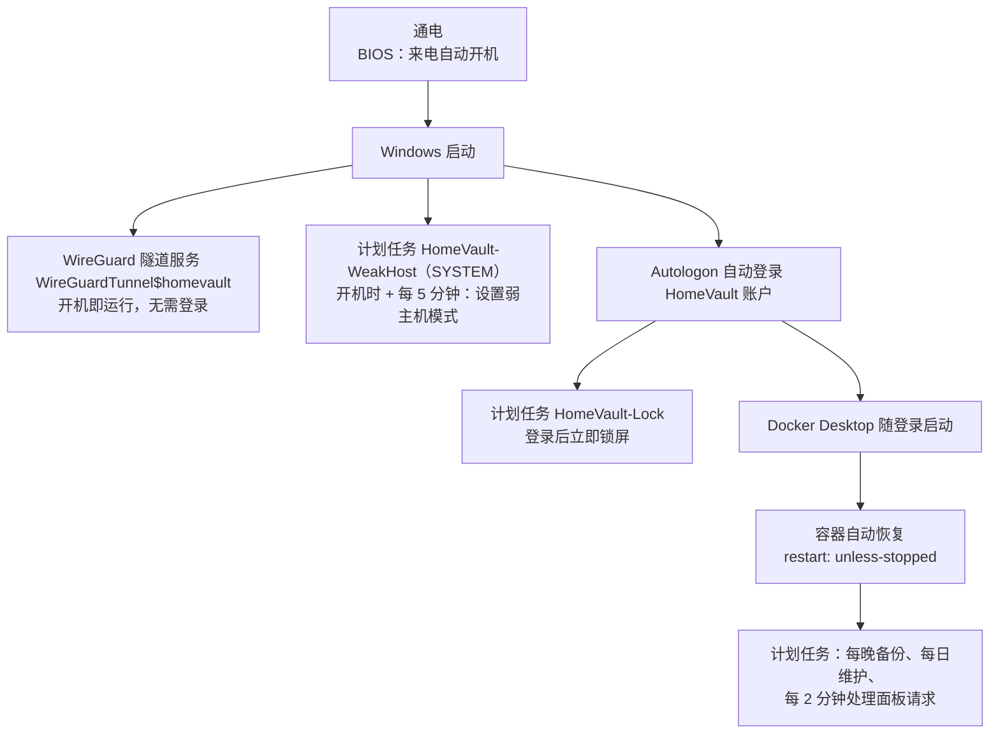

# 03 · Windows 部署（Windows 10/11 + Docker Desktop）

本文带你在一台 Windows 电脑上部署 HomeVault。Windows 版的功能和 Linux 版相同，而且做了"傻瓜化"：**双击 `一键安装.cmd` 安装，以后双击桌面上的"HomeVault 管理"用数字菜单管理**。不过 Windows 本身有一些限制（开机必须有人登录、NTFS 的特性等），所以请至少把 §0、§2、§5、§7 读一遍。

相关文档：[docs/01-架构与安全.md](01-架构与安全.md) · [docs/02-Linux部署.md](02-Linux部署.md) · [docs/04-VPN与DDNS.md](04-VPN与DDNS.md) · [docs/05-安卓手机备份.md](05-安卓手机备份.md) · [docs/08-日常运维与升级.md](08-日常运维与升级.md) · [docs/10-安卓管理App与管理面板.md](10-安卓管理App与管理面板.md)

> **最快路线：** 做完 §2 的准备 → 按 §5 双击 `一键安装.cmd`（它会检查 Docker Desktop、WireGuard 等前置软件，没装的可以用 winget 自动安装）→ 在路由器上转发一个 UDP 端口 → 按 [docs/05-安卓手机备份.md](05-安卓手机备份.md) 设置手机。§3、§4 是手动安装前置软件和检查设置的说明。

> **命令写法：** 本文的命令都在 HomeVault 目录里，用**管理员身份**打开 PowerShell 执行，写法是 `.\windows\hv.ps1 <命令>`，`.\windows\hv.ps1 help` 可以列出全部命令。大部分日常操作也可以在"HomeVault 管理"菜单里完成（§5.6），不用记命令。

---

## 0. 先想清楚：Windows 版和 Linux 版的区别

| 方面 | Linux 版 | Windows 版 |
|---|---|---|
| 安装和管理 | 命令行 `sudo ./hv …` | 双击 `一键安装.cmd` 安装；桌面快捷方式"HomeVault 管理"打开数字菜单；也可以用 `.\windows\hv.ps1 …` |
| VPN 服务端 | wg-easy 容器（带网页管理界面） | **WireGuard for Windows** 隧道服务，用菜单或 `.\windows\hv.ps1 vpn` 管理。wg-easy 在 Docker Desktop 上无法可靠运行，所以不用它 |
| 开机后无人登录时 | 所有服务照常运行 | WireGuard 服务照常运行，但 **Docker Desktop 必须有用户登录后才会启动**。所以要配置"自动登录 + 立即锁屏" |
| Nextcloud 数据目录 | Linux 文件系统（ext4/btrfs） | NTFS 文件夹，可以直接在资源管理器里看到，但速度较慢，而且**不区分大小写**（见 §11） |
| 日志目录 | `HV_DATA_DIR/logs`（默认 `/srv/homevault/logs`） | `<数据盘>:\HomeVault\logs`，资源管理器里直接能看（见 §14） |
| 定时任务 | systemd 定时器 | Windows 任务计划程序（见 §7.5） |
| 数据库等程序数据 | 主机目录 | Docker Desktop 虚拟磁盘里的命名卷 |
| 硬盘健康监控 | Scrutiny | CrystalDiskInfo 等 Windows 工具 |

**什么时候选 Windows 版：** 这台电脑平时还要当 Windows 用，或者你暂时不想接触 Linux。
**更稳的替代方案：** Windows 专业版可以用 Hyper-V 虚拟机运行 Linux 版，见 [§12](#12-替代方案hyper-v-虚拟机--linux-套件仅专业版)。

---

## 1. 系统要求

| 项目 | 要求 |
|---|---|
| 操作系统 | **推荐 Windows 11**（23H2 或更新）。Windows 10 需要 22H2（19045） |
| ⚠️ Windows 10 支持期 | Windows 10 已于 2025-10-14 结束支持，面向个人用户的扩展安全更新（ESU）将于 **2026-10-13** 结束。Docker 只支持仍在微软服务期内的 Windows 版本，新部署请用 Windows 11 |
| 版本（家庭版/专业版） | 家庭版、专业版都可以用 WSL2 运行 Linux 容器。完整的 BitLocker 和 Hyper-V 只有专业版、企业版、教育版才有 |
| Docker Desktop | **≥ 4.92.0**，使用 WSL2 后端（截至 2026-09 的最新版是 4.92.0，发布于 2026-09-21）。4.92.0 修复了"把虚拟磁盘移到其他盘总是失败"的问题。个人使用和小型企业免费 |
| WSL | ≥ 2.1.5 |
| WireGuard for Windows | 官方安装包 |
| winget（可选） | Windows 11 和较新的 Windows 10 自带（属于"应用安装程序 / App Installer"）。有它时，一键安装可以帮你自动装前置软件；没有也能手动安装 |
| 内存 | 建议 ≥ 16 GB |
| 其他 | BIOS 里已开启 CPU 虚拟化；"Server"（LanmanServer）服务处于启用并自动启动状态（Docker Desktop 的要求，默认就是这样） |
| 网络 | 公网 IPv4 + 路由器支持 UDP 端口转发（见 [docs/04-VPN与DDNS.md](04-VPN与DDNS.md)） |

---

## 2. 准备工作

### 2.1 固定局域网 IP

在路由器的"DHCP 静态分配 / IP 与 MAC 绑定"里给这台电脑固定一个地址，例如 `192.168.1.10`。手机访问地址和 VPN 配置都依赖这个 IP。尽量用**有线网络**。

### 2.2 准备一个专用的本地账户（推荐）

Docker Desktop 只有在某个用户**登录之后**才会启动。为了让停电重启、Windows 更新重启后服务能自己恢复，HomeVault 会配置"开机自动登录 + 登录后立即锁屏"。建议：

1. 新建一个**本地账户**，例如 `homevault`，设置一个**独有的强密码**，并加入管理员组（HomeVault 的安装和管理需要管理员权限）。请不要用微软账户。如果 Docker Desktop 是用别的账户安装的，还要把这个账户加入 `docker-users` 组。
2. 以后**登录这个账户**来安装 Docker Desktop、运行一键安装，自动登录也用这个账户。
3. 家人日常使用这台电脑时，用各自的账户，通过**切换用户**登录。HomeVault 账户的会话会在后台继续运行。

⚠️ **不要注销** HomeVault 账户。注销会关闭 Docker Desktop，所有服务随之停止。离开时锁屏或切换用户即可。

### 2.3 规划硬盘

先在"此电脑"和"磁盘管理"里看清你有几块**物理硬盘**，每块上有哪些盘符。建议：

| 用途 | 建议 |
|---|---|
| 系统盘 C: | 只放系统和程序 |
| **主数据盘**（例如 D:） | 容量最大、最健康的**内置**硬盘，NTFS 格式。照片、视频和日志都放在这里 |
| 额外存储（例如 E:） | 已有的照片、资料盘，可以只读挂进 Nextcloud |
| **备份盘**（例如 F:） | **另一块物理硬盘**，内置或 USB 都可以 |
| Docker Desktop 虚拟磁盘 | 从 C: 挪到一块 SSD 或数据盘上（见 §3.3） |

---

## 3. WSL2 和 Docker Desktop（手动安装与检查）

> 一键安装（§5）发现没装 Docker Desktop 时，会询问是否用 winget 自动安装。不管是自动还是手动装的，都请对照 §3.2 的表格检查一遍设置。

### 3.1 WSL

用管理员身份打开 PowerShell：

```powershell
wsl --version          # 查看版本；如果提示命令不存在或未安装，执行下一行
wsl --install          # 首次安装，完成后按提示重启
wsl --update           # 已安装的，更新到最新
```

确认 WSL 版本 ≥ 2.1.5。

### 3.2 Docker Desktop

1. 从 Docker 官网下载 Docker Desktop for Windows 安装包（≥ 4.92.0），或者用 winget：`winget install -e --id Docker.DockerDesktop`。
2. **以 HomeVault 账户**运行安装程序，选择 **WSL 2** 后端。
   想在安装时就把 Docker 的数据放到别的盘，可以在安装包所在目录用命令行安装：

   ```powershell
   Start-Process '.\Docker Desktop Installer.exe' -Wait -ArgumentList 'install', '--wsl-default-data-root=D:\DockerDesktop'
   ```

3. 装完通常需要**重启电脑**。重启后打开一次 Docker Desktop，接受许可协议，然后打开 **Settings**，检查：

| 位置 | 设置 | 原因 |
|---|---|---|
| General | ✔ **Start Docker Desktop when you sign in to your computer** | 开机自动登录后自动启动 Docker（默认是关闭的！） |
| General | ✔ Use the WSL 2 based engine | HomeVault 使用 WSL2 后端 |
| Resources → Advanced | **Disk image location**：改到 C: 以外的盘，见 §3.3 | 避免 C: 被撑满 |
| Software updates | "Always download updates" 保持关闭（默认） | 由你决定什么时候更新，见 [docs/08-日常运维与升级.md](08-日常运维与升级.md) |

### 3.3 把 Docker Desktop 的虚拟磁盘移出 C:

Docker 的镜像、数据库、Nextcloud 程序文件、证书都存放在一个虚拟磁盘文件里，默认位于 `C:\Users\<用户名>\AppData\Local\Docker\wsl`。

- 在 **Settings → Resources → Advanced → Disk image location** 里选一个新文件夹，例如 `D:\DockerDesktop`，然后应用。
- ⚠️ 4.92.0 之前的版本，移到**另一个盘**会一直失败，请先升级到 ≥ 4.92.0。最好在**创建任何容器之前**就移好。
- 这个虚拟磁盘文件只会变大，不会自动缩小。WSL 虚拟磁盘默认最大 1 TB。HomeVault 的照片和视频不在里面，而是放在 NTFS 数据目录里，所以一般够用。

### 3.4（可选）限制 WSL 占用的内存

WSL2 模式下，内存、CPU 等资源限制在 `%USERPROFILE%\.wslconfig` 里设置，不在 Docker Desktop 界面里。例如：

```ini
[wsl2]
memory=8GB
```

修改后执行 `wsl --shutdown`，再重新启动 Docker Desktop 生效。

### 3.5 国内拉取镜像

国内一般无法直接访问 Docker Hub，`ghcr.io` 也可能无法访问。两种办法：

1. **推荐：** 安装向导里问"是否在中国大陆网络下使用 DaoCloud 镜像"时回答"是"，或者命令行安装时加 `--mirror daocloud`（见 §5.7）。它会把镜像地址整体换成国内镜像站前缀，构建管理面板时用的 Go 构建镜像也走这个前缀。
2. 在 Docker Desktop 的 **Settings → Docker Engine** 里加上 `registry-mirrors`（只对 docker.io 有效）：

   ```json
   {
     "registry-mirrors": ["https://docker.m.daocloud.io"]
   }
   ```

公共镜像站通常有白名单和限流规则，拉取失败时换一个试试。详见 [docs/02-Linux部署.md](02-Linux部署.md) §3。

---

## 4. WireGuard for Windows（手动安装）

> 一键安装发现没装 WireGuard 时，会询问是否用 winget 自动安装（`WireGuard.WireGuard`）。

1. 从 WireGuard 官方下载并安装：<https://download.wireguard.com/windows-client/wireguard-installer.exe>
2. 装好即可，**不需要**在 WireGuard 界面里手动创建隧道。HomeVault 会：
   - 用 WireGuard 自带的 `wg.exe` 生成密钥；
   - 把服务端配置写到 `C:\ProgramData\HomeVault\wireguard\homevault.conf`，只允许 SYSTEM 和管理员访问；
   - 安装名为 `WireGuardTunnel$homevault` 的隧道服务。它**开机就启动，不需要任何人登录**。

---

## 5. 一键安装

### 5.1 下载并放到固定位置

1. 在 GitHub 项目页面（<https://github.com/yuelanxian/->）点 **Code → Download ZIP**；会用 git 的也可以 `git clone`。
2. **解压之前**，右键 ZIP 文件 → **属性** → 勾选底部的"**解除锁定**" → 确定。这样解压出来的脚本不会被 Windows 当成"来自网络的文件"拦截。
3. 解压到一个**固定目录**，例如 `C:\Tools\homevault`。以后不要移动这个目录：`.env`、`secrets\`、`storage.conf`、`state\` 都会生成在这里，它们也会被一起备份。

⚠️ 不要把 HomeVault 目录放在 Nextcloud 数据目录里面，反过来也不要。特别是**不要解压到 `D:\HomeVault`、`E:\HomeVault` 这类 `<盘符>:\HomeVault` 文件夹**：安装程序默认把数据放在"主数据盘"的 `<盘符>:\HomeVault\`（Nextcloud 文件、日志、数据库导出都在里面），两者混在一起会让照片被重复备份进 HomeVault 目录的备份里。

### 5.2 双击 `一键安装.cmd`

以 HomeVault 账户登录，打开 HomeVault 目录，**双击 `一键安装.cmd`**：

1. Windows 弹出"用户账户控制"窗口，问是否允许更改 → 点**是**（安装需要管理员权限）。
2. 如果弹出蓝色的"Windows 已保护你的电脑"，说明没有做 §5.1 第 2 步：点"**更多信息 → 仍要运行**"。
3. 出现一个黑色窗口，里面是中文的安装向导。**不需要**自己修改 PowerShell 的执行策略，`一键安装.cmd` 已经替你处理好了。

安装中途关掉了、失败了，或者要安装前置软件而重启了电脑，**再次双击 `一键安装.cmd` 即可**。重新运行是安全的：已有的设置会保留，**不会重新生成密码**。

### 5.3 前置软件检查（winget）

向导首先检查前置软件。缺哪个，会先问你，**你同意后**才用 winget 安装：

| 软件 | winget 包名 | 用途 | 说明 |
|---|---|---|---|
| Docker Desktop | `Docker.DockerDesktop` | 运行所有容器 | 约 600 MB。装完后安装程序会停下来：请**重启电脑**（或注销后重新登录），打开 Docker Desktop 完成首次设置（接受协议，登录可以跳过），看到左下角显示 **Engine running** 后，按 §3.2 检查设置，再重新双击 `一键安装.cmd` |
| WireGuard for Windows | `WireGuard.WireGuard` | VPN 服务端 | 只装软件，隧道由 HomeVault 创建 |
| Sysinternals Autologon | `Microsoft.Sysinternals.Autologon` | 开机自动登录 | 用于停电重启后自动恢复，见 §7.1 |

- 电脑上没有 winget 时，按 §3、§4 手动安装，Autologon 可以从微软官网下载。
- 国内网络下 winget 下载可能较慢，耐心等待；失败时同样可以手动安装。
- Docker Desktop 已安装但没有运行时，向导会自动启动它并等待（最多约 5 分钟）。一直没好的话，手动打开 Docker Desktop，等左下角显示"Engine running"后再双击 `一键安装.cmd`。
- 提示"Docker Desktop 当前处于 Windows 容器模式"时：右键任务栏右下角的 Docker 图标，选择 **Switch to Linux containers**。

### 5.4 安装向导会问哪些问题

每个问题都有默认值，**直接回车就是接受默认值**。具体措辞和顺序以屏幕提示为准：

| 步骤 | 内容 | 建议 |
|---|---|---|
| 局域网 IP / 网段 | 自动检测，请确认 | 应该就是 §2.1 固定的 IP |
| 访问方式 | IP 模式（`internal`，默认）或域名模式（`acme-dns`） | 有域名推荐域名模式，原因见 [docs/01-架构与安全.md](01-架构与安全.md) §1.3 |
| **主数据盘** | 显示硬盘表，**输入盘符**选择主数据盘 | 见 §6 |
| **日志** | 日志目录（默认在主数据盘上，例如 `D:\HomeVault\logs`）；日志保留天数，1–365 天，默认 **7** | 目录保持默认即可；保留天数一般 7 天，想查更久以前的问题可以设 30 天。以后可以随时改（§14） |
| VPN | 对外地址 `WG_HOST`（DDNS 域名或公网 IP）；端口 `WG_PORT` 随机生成 | 记下端口，路由器要用 |
| 国内镜像 | 是否使用 DaoCloud 镜像拉取 Docker 镜像 | 在中国大陆选"是" |
| 额外存储（可选） | 是否把其他硬盘上已有的文件夹挂进 Nextcloud | 见 §6 |
| **备份目标** | 本地硬盘（输入盘符）/ S3 / 暂不备份；是否创建每日备份计划任务 | 备份盘最好是另一块物理硬盘，见 §6 |
| 安卓管理 App | 是否从 GitHub 下载"HomeVault 家庭归档"安装包，放到服务器上供手机扫码安装 | 可以回答"是"；网络不通也不影响安装，以后可运行 `android fetch` |
| 开机自启 | 是否配置自动登录、登录后锁屏、电源设置 | 见 §7、§8，每项都会先问你 |

之后向导会自动：写入 `.env` 和 `secrets\`、配置 WireGuard 隧道服务和 Windows 防火墙、构建管理面板镜像、启动服务并等待 Nextcloud 就绪、初始化备份仓库、创建计划任务（§7.5）、创建桌面快捷方式"HomeVault 管理"、导出根证书并询问是否装进本机（IP 模式）。第一次需要下载镜像，可能要十几分钟到几十分钟。

> 端口（80、443、8443、9443）不会询问，被占用时安装程序会提示，用 `--https-port`、`--http-port`、`--admin-port`、`--panel-port` 换一个（§5.7）。

### 5.5 安装完成

最后会显示一份总结：

- Nextcloud 访问地址，例如 `https://192.168.1.10`；
- 管理面板地址，例如 `https://192.168.1.10:9443`；
- 管理员 `hvadmin` 的初始密码；
- **restic 备份密码**；
- 根证书的保存位置和 SHA-256 指纹（IP 模式）；
- 路由器端口转发说明：**UDP `WG_PORT` → 这台电脑的局域网 IP**；
- 下一步清单。

> ⚠️ 管理员密码和 restic 备份密码**只显示这一次**，请马上保存到密码管理器，restic 密码最好再抄一份在纸上离线保存。**丢了 restic 密码，备份就再也打不开了。**

同时：

- 浏览器会自动打开**管理面板**，用 `hvadmin` 登录即可（第一次登录 Nextcloud 时要先绑定二步验证）。面板的用法见 [docs/10-安卓管理App与管理面板.md](10-安卓管理App与管理面板.md)；
- 桌面上会出现快捷方式"**HomeVault 管理**"。

### 5.6 以后怎么管理："HomeVault 管理"菜单

双击桌面上的"**HomeVault 管理**"（或者 HomeVault 目录里的 `windows\HomeVault管理.cmd`），确认"用户账户控制"提示后，会打开一个数字菜单。输入编号，回车：

| 编号 | 菜单项 | 作用 | 相当于命令 |
|---|---|---|---|
| 1 | 状态 | 各服务是否在运行、是否健康，访问地址 | `status` |
| 2 | 启动 | 启动全部服务 | `up` |
| 3 | 停止 | 停止全部服务（数据保留） | `down` |
| 4 | 查看日志 | 查看服务日志和 HomeVault 日志文件 | `logs` |
| 5 | 日志保留天数 | 查看或修改日志保留天数（1–365） | `logs retention <天数>` |
| 6 | 添加手机VPN | 为一台新手机生成 VPN 配置，在浏览器里显示二维码 | `vpn add <名称>` |
| 7 | VPN设备列表 | 列出所有 VPN 设备 | `vpn list` |
| 8 | 立即备份 | 马上做一次 restic 备份 | `backup` |
| 9 | 备份记录 | 列出备份快照 | `backup --snapshots` |
| 10 | 存储/硬盘 | 硬盘表和已配置的额外存储 | `storage list` |
| 11 | 打开管理面板 | 在浏览器里打开 `https://HV_HOST:9443` | — |
| 12 | 打开日志文件夹 | 在资源管理器里打开日志目录 | `logs open` |
| 13 | 健康检查 | 逐项体检，✔/✘ 标出问题 | `doctor` |
| 14 | 更新 | 先备份，再更新到当前大版本的最新补丁版 | `update` |
| 15 | 用户管理 | 添加家人账户、重置密码或二步验证 | `user add / list / reset-password / reset-2fa` |
| 0 | 退出 | — | — |

菜单没有覆盖的操作（例如恢复文件、增删额外存储、防火墙、DDNS），用 §5.7 的命令行完成。

### 5.7 命令行方式（高级）

不想用 `一键安装.cmd`，或者要一次性指定参数时，可以在管理员 PowerShell 里运行：

```powershell
cd C:\Tools\homevault
# 只对当前窗口放开脚本执行限制
Set-ExecutionPolicy -Scope Process -ExecutionPolicy Bypass -Force

.\windows\hv.ps1 install
# 国内网络，使用 DaoCloud 公共镜像前缀：
.\windows\hv.ps1 install --mirror daocloud
# 或者自己输入 docker.io 和 ghcr.io 的镜像前缀：
.\windows\hv.ps1 install --mirror custom
# 不提问，直接指定主数据盘、备份盘和日志保留天数：
.\windows\hv.ps1 install --non-interactive --data-drive D --backup-drive F --wg-host home.example.com --log-retention 14
```

`.\windows\install.ps1` 和 `.\windows\hv.ps1 install` 效果相同。全部参数见 `.\windows\hv.ps1 help`。

---

## 6. 选择硬盘（多块硬盘时请仔细看）

安装时和运行 `.\windows\hv.ps1 storage list`（菜单 **10**）时，会显示这样一张表：

```text
盘符 卷标   文件系统 总容量   可用     物理磁盘# SSD/HDD 系统盘 USB BitLocker
C:   系统   NTFS     476 GB   210 GB   0         SSD     是     否  开
D:   数据   NTFS     3.6 TB   3.4 TB   1         HDD     否     否  关
E:   资料   NTFS     1.8 TB   0.4 TB   2         HDD     否     否  关
G:   旧盘   NTFS     931 GB   500 GB   2         HDD     否     否  关
F:   备份   NTFS     4.5 TB   4.5 TB   3         HDD     否     是  关
```

安装向导会让你**输入盘符**来选择，例如主数据盘输入 `D`，备份盘输入 `F`。

**怎么看这张表：**

- **物理磁盘#** 最重要：编号相同的盘符在**同一块物理硬盘**上。上例中 E: 和 G: 都在 2 号硬盘上，这块硬盘坏了，两个盘符的数据会一起没。
- **SSD/HDD**：固态硬盘或机械硬盘。
- **系统盘**：装 Windows 的那块。
- **USB**：外置 USB 硬盘。
- **BitLocker**：是否已加密，见 [docs/01-架构与安全.md](01-架构与安全.md) §5。

**三种角色：**

| 角色 | 在上例中的选择 | 说明 |
|---|---|---|
| **主数据** | `D:` | 全家的手机照片和视频都在这里，数据目录为 `D:\HomeVault\nextcloud-data`，**在资源管理器里能直接看到**，重置 Docker Desktop 也不会丢。日志目录默认也在这块盘上：`D:\HomeVault\logs` |
| **额外存储** | `E:\照片归档`（读写）、`G:\影视`（只读） | 已有文件夹挂进 Nextcloud，可以设为只读，也可以只给某些人看 |
| **备份目标** | `F:` | 和主数据**不在同一块物理硬盘上**（物理磁盘# 3 ≠ 1）。备份仓库默认放在 `F:\HomeVault-Backup\restic` |

安装程序会在这些情况给出警告：

- ⚠️ 主数据选了**系统盘**：重装系统或系统盘故障会同时威胁数据；
- ⚠️ 主数据选了 **USB 外置盘**：拔掉或盘符变化后 Nextcloud 无法启动；
- ⚠️ 选了 **FAT32**（单个文件不能超过 4 GB，手机长视频会失败）或 **exFAT**（没有权限控制，断电容易损坏）。建议改用 NTFS；
- ⚠️⚠️ **备份目标和主数据（或某个读写的额外存储）在同一块物理硬盘上**：这块硬盘坏了，数据和备份会一起丢。请换一块硬盘，或者用 S3 异地备份。

管理面板的**存储**页也会显示每块硬盘的用量，并提醒"备份目标与……位于同一块磁盘"。

**备份盘用 USB 移动硬盘可以吗？** 可以，但要保证备份时间（默认 03:30）它是插着的，而且**盘符不能变**。可以在"磁盘管理"里给它固定一个不常用的盘符（例如 `R:`）。

### 6.1 以后管理额外存储

```powershell
.\windows\hv.ps1 storage list
.\windows\hv.ps1 storage add          # 交互式添加
.\windows\hv.ps1 storage remove 影视资料
.\windows\hv.ps1 storage apply
```

配置保存在 `storage.conf`，格式和 Linux 版相同：

```text
# 名称|主机路径|rw或ro|是否备份(yes/no)|可见用户(空=所有用户; 逗号分隔; @开头为群组)
照片归档|E:\照片归档|rw|yes|
影视资料|G:\影视|ro|no|@family
```

`storage apply` 同时会让管理面板能统计这些硬盘的容量（只读挂载，面板不读取文件内容）。

- 挂载有变化时，`apply` 会**重建容器**，包括管理面板：面板的登录会话只保存在内存里，已登录面板（和安卓管理 App）的人需要重新登录。
- 额外存储里的文件，能看到这个存储的家人都能读到（`rw` 时还能修改）。所以**不要**选择系统文件夹（`C:\Windows`、`C:\Program Files` 等）、整个盘的根目录，也不要选择和 HomeVault 自己的文件夹重叠的位置：HomeVault 程序目录（含 `secrets\` 密钥）、Nextcloud 数据目录、日志目录、备份仓库。

---

## 7. 开机自启链：停电来电后能自己恢复

Windows 上，从通电到服务恢复，要经过下面这一串步骤。每一环都要配置好：



```text
通电 ─▶ (BIOS 来电开机) ─▶ Windows 启动 ─┬─▶ WireGuard 隧道服务（无需登录）
                                          ├─▶ HomeVault-WeakHost 任务（SYSTEM）
                                          └─▶ Autologon 自动登录 ─┬─▶ HomeVault-Lock 立即锁屏
                                                                  └─▶ Docker Desktop ─▶ 容器恢复
```

安装向导的"开机自启"部分会逐项询问。以后想重新检查或补做，运行 `.\windows\hv.ps1 autostart`。

### 7.1 自动登录（Sysinternals Autologon）

安装程序会询问是否配置。没装 Autologon 时，它会询问是否用 `winget install Microsoft.Sysinternals.Autologon` 安装，然后打开 Autologon 窗口。在窗口里：

1. 填写用户名（HomeVault 账户）、域（本地账户填这台电脑的名字）和密码；
2. 点 **Enable**。

没有 winget 时，请从微软官网下载 Sysinternals Autologon，以 HomeVault 账户运行，步骤相同。

需要知道的几点：

- 密码以加密形式保存在注册表里（LSA 机密），但**任何有管理员权限的人都能取出来**。所以这个账户的密码不要和别处共用。
- 开机时**按住 Shift 键**，可以跳过这一次自动登录。
- 想取消自动登录，再次运行 Autologon，点 **Disable**。

### 7.2 登录后立即锁屏（计划任务 `HomeVault-Lock`）

自动登录后，桌面不能一直开着给路过的人用。安装程序会创建计划任务 `HomeVault-Lock`：用户一登录就锁定工作站。锁屏**不会**影响 Docker Desktop 和容器的运行。

### 7.3 Docker Desktop 随登录启动

确认 Docker Desktop 设置里已勾选 **Start Docker Desktop when you sign in to your computer**（§3.2）。安装向导和 `doctor` 都会检查并提醒这一项。

### 7.4 验证

配好之后，**重启一次**电脑，什么都不要动，等 3–5 分钟：

- 屏幕应显示锁屏界面；
- 手机（关掉 Wi-Fi，用流量连 VPN）能打开 Nextcloud 和管理面板；
- 解锁后在菜单里选 **13 健康检查**（或运行 `.\windows\hv.ps1 doctor`），全部 ✔。

### 7.5 HomeVault 创建的计划任务

打开"**任务计划程序**"（开始菜单搜索"任务计划程序"），在"任务计划程序库"里可以看到这些以 `HomeVault-` 开头的任务：

| 任务名 | 什么时候运行 | 做什么 |
|---|---|---|
| `HomeVault-Lock` | HomeVault 账户登录时 | 立即锁屏（§7.2） |
| `HomeVault-WeakHost` | 开机时、之后每 5 分钟，以及每次修改 VPN 设备后（以 SYSTEM 身份） | 给隧道网卡开启弱主机模式，让 VPN 设备能访问主机的局域网 IP（§10） |
| `HomeVault-Backup` | 每天 `HV_BACKUP_TIME`（默认 03:30），以已登录的 HomeVault 账户身份 | 运行 `hv.ps1 backup`，restic 加密备份（见 [docs/07-备份与恢复.md](07-备份与恢复.md)） |
| `HomeVault-Maintenance` | 每天 04:00（错过时开机后补做），以已登录的 HomeVault 账户身份，后台无窗口 | 运行 `hv.ps1 maintenance`：导出前一天的容器日志、按日期轮转 Nextcloud 日志、删除超过保留天数的日志、更新管理面板用的状态文件（§14） |
| `HomeVault-Requests` | 每 2 分钟，以已登录的 HomeVault 账户身份，后台无窗口 | 运行 `hv.ps1 requests process`：执行管理面板提交的请求（立即备份、清理日志、修改保留天数），只执行这三种；同时更新 `state\status.json` |
| `HomeVault-VpnStatus` | 开机时、之后每 2 分钟（以 SYSTEM 身份，启用 VPN 时才有） | 把各 VPN 设备的最近握手时间和流量写入 `state\vpn-status.json`（管理面板的 VPN 页用），里面不含任何密钥 |

- 不想等计划任务时，也可以在管理员 PowerShell 里手动运行：`.\windows\hv.ps1 requests process`（立即执行面板提交的请求）、`.\windows\hv.ps1 status-update`（立即刷新面板读取的状态文件）、`.\windows\hv.ps1 maintenance`（每日维护）。
- 在任务上右键 → **运行**，可以立即执行一次；选中任务后看下方的"**历史记录**"标签（需要先在右侧点"启用所有任务历史记录"），可以看到每次运行的结果。
- 不要手动修改或删除这些任务。需要修改备份时间，运行 `.\windows\hv.ps1 schedule-backup --time 04:00`；删掉了某个任务，重新双击 `一键安装.cmd` 即可恢复（`HomeVault-Backup` 也可以用 `schedule-backup` 单独恢复）。

---

## 8. 电源设置和 BIOS

### 8.1 不睡眠、不休眠

安装程序会先征求你的同意，再设置"接通电源时从不睡眠"。等价的手动命令（管理员 PowerShell）：

```powershell
powercfg /change standby-timeout-ac 0     # 从不睡眠
powercfg /change hibernate-timeout-ac 0   # 从不休眠
powercfg /change disk-timeout-ac 0        # 从不关闭硬盘
powercfg /hibernate off
```

显示器可以正常关闭，不影响服务。

### 8.2 BIOS：来电自动开机

停电后来电，电脑要能自己开机。进入 BIOS/UEFI 设置，找到类似 **Restore on AC Power Loss**、**AC Back**、**After Power Failure** 的选项（名字因主板厂商而异），设为 **Power On**。

⚠️ 如果 BitLocker 设置了**开机 PIN**，来电开机后会一直停在输入 PIN 的界面，后面的自启链都不会发生。无人值守的服务器请使用 TPM 自动解锁。

### 8.3 Windows 更新重启

Windows 更新后需要重启，重启后 §7 的自启链会自动恢复服务，所以**允许它在夜间自动重启**即可：

- 在 **设置 → Windows 更新 → 高级选项 → 使用时段** 里，把白天常用的时间段设为使用时段，让重启发生在夜里；
- 夜间重启可能打断正在进行的备份，下一次备份会重新进行；
- 第二天早上看一眼管理面板的**概览**页，或者运行一次健康检查。

---

## 9. Windows 防火墙

安装时会自动配置。以后需要时：

```powershell
.\windows\hv.ps1 firewall --apply   # 创建/更新规则
.\windows\hv.ps1 firewall --show    # 查看
```

HomeVault 会添加这些规则（都在规则组"HomeVault"里，适用于所有网络类型，`-Profile Any`）：

| 规则名 | 动作 | 内容 |
|---|---|---|
| `HomeVault-HTTPS` | 允许 | TCP `HV_HTTP_PORT`、`HV_HTTPS_PORT`、`HV_ADMIN_PORT`、`HV_PANEL_PORT`（默认 80、443、8443、9443），**只允许**来源是局域网网段（`HV_LAN_CIDR`）和 VPN 网段（`HV_VPN_CIDR`） |
| `HomeVault-Block-Other` | 阻止 | 同样这几个端口，来源是**其他任何 IPv4 地址**时阻止 |
| `HomeVault-Block-IPv6` | 阻止 | 同样这几个端口，阻止所有 IPv6 来源 |
| `HomeVault-WireGuard` | 允许 | UDP `WG_PORT`（启用 VPN 时） |

为什么规则要适用于所有网络类型：WireGuard 的隧道网卡通常被 Windows 识别为"未识别的网络"，也就是**公用网络**。规则只写"专用网络"的话，VPN 客户端会被挡住。

为什么还要"阻止"规则：国内宽带普遍有 IPv6 公网地址，而 Docker Desktop 可能自带"允许任何来源"的规则（见 §9.1）。Windows 防火墙里**阻止规则优先于允许规则**，所以有了这两条阻止规则，局域网和 VPN 以外的来源一律进不来（原因见 [docs/01-架构与安全.md](01-架构与安全.md) §3.2）。

### 9.1 Docker Desktop 的宽泛放行规则

Docker Desktop 安装时，可能会给它的后台程序 `com.docker.backend.exe` 添加"允许任何来源"的入站规则。HomeVault 的阻止规则已经能挡住它们对上述端口的放行；`firewall --apply` 会列出这些规则，并询问是否顺便把它们禁用（更严格，默认不禁用）。`doctor` 发现有这类规则、却缺少 HomeVault 阻止规则时会警告。你也可以手动查看：

```powershell
Get-NetFirewallApplicationFilter -Program *com.docker.backend.exe | Get-NetFirewallRule |
  Where-Object { $_.Direction -eq 'Inbound' -and $_.Action -eq 'Allow' -and $_.Enabled -eq 'True' } |
  Select-Object DisplayName, Profile
```

想禁用它们：运行 `.\windows\hv.ps1 firewall --apply --disable-docker-rules`。Docker Desktop 更新后这些规则可能重新出现，届时再运行一次即可。

---

## 10. VPN：弱主机模式是什么

手机通过 VPN 访问的仍然是 `https://<局域网 IP>`。但这些数据包是从 WireGuard 的隧道网卡进来的，而局域网 IP 属于另一块网卡（有线网卡）。Windows 默认采用"强主机模式"，会**丢弃**这种数据包。

HomeVault 的做法是：

- 对隧道网卡（名称 `homevault`）开启**弱主机接收/发送**（`WeakHostReceive` / `WeakHostSend`）；
- 隧道服务每次重启，这块网卡都会被重新创建，设置也随之丢失。所以 HomeVault 创建了以 SYSTEM 身份运行的计划任务 `HomeVault-WeakHost`：开机时运行，之后每 5 分钟运行一次，每次修改 VPN 客户端后也会立即运行；
- IP 模式下，站点地址里还额外包含隧道地址（例如 `https://10.99.77.1`），可以作为排错时的备用地址（管理面板只在标准地址 `https://HV_HOST:9443` 上提供）。

检查是否生效：

```powershell
Get-NetIPInterface -InterfaceAlias homevault |
  Select-Object InterfaceAlias, AddressFamily, WeakHostReceive, WeakHostSend
```

两列都应显示 `Enabled`。`doctor` 也会检查这一项。

**管理 VPN 客户端：**

```powershell
.\windows\hv.ps1 vpn status              # 隧道服务状态
.\windows\hv.ps1 vpn add <名称>          # 添加一台设备（菜单 6）：生成配置，在浏览器里显示二维码
.\windows\hv.ps1 vpn list                # 列出所有设备（菜单 7）
.\windows\hv.ps1 vpn qr <名称>           # 重新显示二维码
.\windows\hv.ps1 vpn remove <名称>       # 删除一台设备（手机丢失时用）
```

- 客户端私钥**不会**保存在服务器上。生成的配置文件（`clients\<名称>.conf`）和二维码页面用完后，程序会提示你删除。
- Windows 版不做 NAT 和转发，VPN 客户端本来就只能访问这台电脑。
- 各设备是否在线、最近握手时间、流量，可以在管理面板的 **VPN** 页查看。

更多内容（DDNS、NAT 回流、网段冲突）见 [docs/04-VPN与DDNS.md](04-VPN与DDNS.md)。

---

## 11. NTFS 数据目录的注意事项

Nextcloud 的主数据目录（例如 `D:\HomeVault\nextcloud-data`）放在 NTFS 上。这样文件能直接在资源管理器里看到，重置 Docker Desktop 也不会丢，但有几点代价：

1. **不区分大小写。** Linux 和 Nextcloud 认为 `IMG_001.jpg` 和 `img_001.jpg` 是两个不同的文件，NTFS 却认为它们是同一个。同一个文件夹里上传这样两个只有大小写不同的文件，会产生冲突或上传失败。手机相机生成的文件名一般不会这样，但从其他电脑整理上传时要注意。
2. ⚠️ **不要在资源管理器里直接修改 `nextcloud-data` 里的文件。** Nextcloud 用数据库记录文件，在 Windows 上又收不到文件变化通知。直接在这里添加、删除、重命名的文件，Nextcloud 不会知道，可能出现"看得见打不开"等问题。
   - 需要在 Windows 上直接整理的文件夹，请用 `storage add` 挂成**额外存储**。额外存储在访问时会检查变化；
   - 确实动过数据目录的，运行 `.\windows\hv.ps1 occ files:scan --all` 让 Nextcloud 重新扫描。
3. **速度较慢。** 容器通过 WSL2 访问 Windows 磁盘比访问 Linux 文件系统慢，对家庭备份来说一般够用。
4. **权限检查已自动关闭。** NTFS 上无法设置 Linux 权限，HomeVault 在安装时自动为 Windows 设置 `check_data_directory_permissions=false`（Nextcloud 官方文档为"Docker on Windows"提供的选项）。所以请保护好 Windows 这一侧的访问权限：不要把数据目录共享给局域网，也不要让不信任的账户访问它。
5. **不要把数据目录放在 USB 硬盘或网络驱动器上。**

数据库、Nextcloud 程序文件、证书等仍然放在 Docker 的**命名卷**里（Docker Desktop 的虚拟磁盘内）。数据库绝不能放在 NTFS 上。

---

## 12. 替代方案：Hyper-V 虚拟机 + Linux 套件（仅专业版）

Windows 专业版、企业版、教育版可以用 Hyper-V 虚拟机运行一台 Ubuntu Server，里面**原样**使用 Linux 版 HomeVault。

**优点：** 虚拟机可以随 Windows 开机自动启动，不需要自动登录；WireGuard 在内核里运行；没有 NTFS 的限制。
**缺点：** 硬盘需要分给虚拟机使用；要多学一点 Hyper-V 知识；家庭版不能用；没有 Windows 版的数字菜单，要用 Linux 命令行（管理面板和安卓 App 照样能用）。

大致步骤：

1. 在"启用或关闭 Windows 功能"里勾选 **Hyper-V**，重启。
2. 打开 **Hyper-V 管理器 → 虚拟交换机管理器**，新建一个**外部**虚拟交换机，绑定到有线网卡。这样虚拟机能在局域网里拿到自己的 IP。
3. 新建第 2 代虚拟机，内存 ≥ 4 GB，挂载 Ubuntu Server 安装镜像，网络选刚才的外部交换机。数据盘可以二选一：
   - 在数据盘上创建一个大的虚拟硬盘文件；
   - 把一整块物理硬盘直通给虚拟机（先在"磁盘管理"里把它设为脱机）。
4. 设置随 Windows 开机自动启动：

   ```powershell
   Set-VM -Name HomeVault -AutomaticStartAction Start
   ```

5. 在路由器上给**虚拟机的 IP** 固定地址，并把 UDP `WG_PORT` 转发到**虚拟机的 IP**。
6. 在虚拟机里按 [docs/02-Linux部署.md](02-Linux部署.md) 部署。

⚠️ 同一台电脑上只运行一套 HomeVault：选了虚拟机方案，就不要再在 Windows 上运行一键安装。

---

## 13. 首次登录、家人账户和备份

Windows 版的这些步骤和 Linux 版完全相同，只是命令写法不同：

| 事项 | 命令 / 菜单 | 详细说明 |
|---|---|---|
| 导出根证书（IP 模式） | `.\windows\hv.ps1 ca --export C:\Users\Public\homevault-ca.crt` | 命令会显示指纹和各系统的安装方法。本机安装：`.\windows\hv.ps1 ca --install`，或 `certutil -addstore -f "ROOT" C:\Users\Public\homevault-ca.crt`。手机也可以从管理面板 `https://HV_HOST:9443/ca.crt` 下载 |
| 首次登录 + 二步验证 | 浏览器打开 `https://<局域网IP>` | [docs/02-Linux部署.md](02-Linux部署.md) §10 |
| 创建家人账户 | 菜单 **15 用户管理**，或 `.\windows\hv.ps1 user add mama --display-name "妈妈" --quota 500GB` | [docs/02-Linux部署.md](02-Linux部署.md) §11 |
| 定时备份 | 安装时已询问；以后 `.\windows\hv.ps1 schedule-backup`（可加 `--time 03:30`） | 创建计划任务 `HomeVault-Backup`，见 [docs/07-备份与恢复.md](07-备份与恢复.md) |
| 立即备份 / 查看备份记录 | 菜单 **8** / **9**，或管理面板的**备份**页 | [docs/07-备份与恢复.md](07-备份与恢复.md) |
| 手机设置 | 菜单 **6 添加手机VPN** 生成 VPN 二维码 | [docs/05-安卓手机备份.md](05-安卓手机备份.md) |
| 管理面板 / 安卓管理 App | 菜单 **11 打开管理面板** | [docs/10-安卓管理App与管理面板.md](10-安卓管理App与管理面板.md) |
| 体检 | 菜单 **13 健康检查**，或 `.\windows\hv.ps1 doctor` | 额外检查：隧道服务在运行、弱主机模式已生效、自动登录和 Docker 自启动的提示 |

路由器端口转发：**UDP `WG_PORT` → 这台电脑的局域网 IP**，只转发这一个端口，不要开 DMZ。详见 [docs/04-VPN与DDNS.md](04-VPN与DDNS.md)。

---

## 14. 日志：放在哪里、保留多久

### 14.1 日志文件夹

Windows 上，HomeVault 的日志默认放在**主数据盘**上，例如 `D:\HomeVault\logs`（`.env` 里的 `HV_LOG_DIR`）。在资源管理器里就能直接打开，也可以用菜单 **12 打开日志文件夹**（`.\windows\hv.ps1 logs open`）。

| 子文件夹 | 内容 |
|---|---|
| `homevault\` | 每次运行 HomeVault 命令和菜单的记录，每天一个文件 `hv-YYYY-MM-DD.log`（**不记录任何密码**） |
| `backup\` | 每次备份一个文件 `backup-YYYYMMDD-HHMMSS.log` |
| `nextcloud\` | Nextcloud 运行日志 `nextcloud.log` 和审计日志 `audit.log`（登录、文件操作、分享、设置变更），每天按日期轮转 |
| `caddy\` | HTTPS 网关的访问日志 `access.log`（谁在什么时候访问了什么） |
| `containers\` | 每天导出的前一天各容器日志 `<服务名>-YYYY-MM-DD.log` |
| `panel\` | 管理面板的操作记录 `panel.log`（登录、立即备份、重启服务等） |

### 14.2 查看日志的几种方式

- **管理面板**的**日志**页：分类列出上面的文件，可以搜索、下载，也能看各容器的实时输出（见 [docs/10-安卓管理App与管理面板.md](10-安卓管理App与管理面板.md) §3）；
- 菜单 **4 查看日志**；
- 命令行：

  ```powershell
  .\windows\hv.ps1 logs                       # 全部服务最近的容器日志
  .\windows\hv.ps1 logs app --follow          # 只看某个服务，并持续跟随（Ctrl+C 退出）
  .\windows\hv.ps1 logs list                  # 列出日志文件
  .\windows\hv.ps1 logs show app --lines 100  # 查看某个服务（或 logs list 里列出的某个文件）的最后 N 行
  .\windows\hv.ps1 logs open                  # 在资源管理器里打开日志文件夹
  ```

- 资源管理器直接打开文件（用记事本即可）；
- Nextcloud 网页：管理员 **管理设置 → 日志**。

### 14.3 保留天数

日志默认保留 **7 天**，安装时可以改。以后任选一种方式修改（1–365 天）：

- 菜单 **5 日志保留天数**；
- 命令 `.\windows\hv.ps1 logs retention 30`（不带数字时显示当前值）；
- 管理面板的**日志**页或**设置**页（由计划任务 `HomeVault-Requests` 在 2 分钟内执行）。

每天的维护任务 `HomeVault-Maintenance` 会删除日志文件夹里超过保留天数的日志文件（只删 `.log`、`.log.*`、`.gz`、`.txt`，不碰别的文件）。想马上清理，运行 `.\windows\hv.ps1 logs clean`，或者在管理面板的日志页点"立即清理旧日志"。

另外两处日志不在这个文件夹里：WireGuard for Windows 自己的日志（`& "$env:ProgramFiles\WireGuard\wireguard.exe" /dumplog /tail`）；各容器最近的输出也保存在 Docker Desktop 里（每个容器最多 3 个 10 MB 的文件）。

---

## 15. Windows 常见问题速查

| 现象 | 可能原因 | 处理 |
|---|---|---|
| 双击 `一键安装.cmd` 后窗口一闪就没了，或提示"Windows 已保护你的电脑" | 文件带有"来自网络"标记；没有同意"用户账户控制" | §5.1 第 2 步解除锁定后重新解压；或点"更多信息 → 仍要运行"；UAC 提示点"是" |
| 提示找不到 winget | 系统没有"应用安装程序" | 在 Microsoft Store 安装"应用安装程序"，或按 §3、§4 手动安装前置软件 |
| 提示 Docker 没有运行 | Docker Desktop 没启动，或刚装完还没接受许可协议 | 打开 Docker Desktop，等显示"Engine running"后重新双击 `一键安装.cmd` |
| 桌面上没有"HomeVault 管理"快捷方式 | 安装没有完成 | 重新双击 `一键安装.cmd`；也可以直接双击 `windows\HomeVault管理.cmd` |
| 重启后手机连不上 Nextcloud，但 VPN 显示已连接 | 没有自动登录，Docker Desktop 没启动 | 检查 §7；看屏幕是否停在登录界面 |
| VPN 已连接，但打不开 `https://<局域网IP>` | 弱主机模式没生效 | 见 §10 的检查命令；运行健康检查 |
| 局域网能访问，VPN 不行，也不是上一条的原因 | 防火墙规则没覆盖公用网络 | `.\windows\hv.ps1 firewall --apply` |
| 管理面板打不开，Nextcloud 正常 | 面板容器没运行；防火墙没放行面板端口 | 菜单 **1 状态** 看 `panel`；`.\windows\hv.ps1 firewall --apply`；更多见 [docs/10-安卓管理App与管理面板.md](10-安卓管理App与管理面板.md) §8 |
| 管理面板里"立即备份"一直"等待主机执行" | 计划任务 `HomeVault-Requests` 没运行（例如被删了，或 HomeVault 账户没登录） | 在任务计划程序里检查；重新双击 `一键安装.cmd` 恢复任务 |
| 移动 Docker 虚拟磁盘失败 | Docker Desktop 版本低于 4.92.0 | 升级后重试 |
| C: 空间越来越少 | Docker 虚拟磁盘还在 C: 上 | §3.3 |
| 大小写不同的同名文件上传失败 | NTFS 不区分大小写 | §11 |

更多问题见 [docs/09-常见问题.md](09-常见问题.md)。

---

## 来源 / 参考

版本信息截至 2026-09：

- Docker Desktop for Windows 安装要求（Windows 版本、WSL ≥ 2.1.5、安装参数 `--wsl-default-data-root`）：<https://docs.docker.com/desktop/setup/install/windows-install/>
- Docker Desktop 设置（"Start Docker Desktop when you sign in to your computer"、Disk image location）：<https://docs.docker.com/desktop/settings-and-maintenance/settings/>
- Docker Desktop 发布说明（4.92.0 修复跨盘移动虚拟磁盘）：<https://docs.docker.com/desktop/release-notes/>
- Docker Desktop WSL2 后端与最佳实践：<https://docs.docker.com/desktop/features/wsl/>
- Docker Desktop 网络（端口由 `com.docker.backend.exe` 转发）：<https://docs.docker.com/desktop/features/networking/>
- "开机不登录无法启动 Docker Desktop"的功能请求：<https://github.com/docker/roadmap/issues/515>
- Docker Desktop 许可：<https://docs.docker.com/subscription/desktop-license/>
- winget（Windows 程序包管理器）：<https://learn.microsoft.com/windows/package-manager/winget/>；包清单：<https://github.com/microsoft/winget-pkgs>（`Docker.DockerDesktop`、`WireGuard.WireGuard`、`Microsoft.Sysinternals.Autologon`）
- 用户账户控制（UAC）：<https://learn.microsoft.com/windows/security/application-security/application-control/user-account-control/>
- PowerShell 执行策略（`-ExecutionPolicy Bypass`）：<https://learn.microsoft.com/powershell/module/microsoft.powershell.core/about/about_execution_policies>
- 任务计划程序 `Register-ScheduledTask`：<https://learn.microsoft.com/powershell/module/scheduledtasks/register-scheduledtask>
- WSL 配置（`.wslconfig`）与磁盘空间：<https://learn.microsoft.com/windows/wsl/wsl-config> · <https://learn.microsoft.com/windows/wsl/disk-space>
- WSL 文件权限（Windows 磁盘上的权限行为）：<https://learn.microsoft.com/windows/wsl/file-permissions>
- WireGuard for Windows（隧道服务、`/installtunnelservice`、`/dumplog`、网络说明）：<https://github.com/WireGuard/wireguard-windows/blob/master/docs/enterprise.md> · <https://github.com/WireGuard/wireguard-windows/blob/master/docs/netquirk.md>
- `Set-NetIPInterface`（WeakHostReceive / WeakHostSend）：<https://learn.microsoft.com/powershell/module/nettcpip/set-netipinterface>
- `New-NetFirewallRule`：<https://learn.microsoft.com/powershell/module/netsecurity/new-netfirewallrule>
- Sysinternals Autologon：<https://learn.microsoft.com/sysinternals/downloads/autologon>
- `Set-VM`（AutomaticStartAction）：<https://learn.microsoft.com/powershell/module/hyper-v/set-vm>
- Nextcloud `check_data_directory_permissions`：<https://docs.nextcloud.com/server/latest/admin_manual/configuration_server/config_sample_php_parameters.html>
- Nextcloud 日志配置（`logfile`、`logfile_audit`、`log_rotate_size`）：<https://docs.nextcloud.com/server/latest/admin_manual/configuration_server/logging_configuration.html>
- Windows 10 支持结束与 ESU：<https://www.microsoft.com/windows/end-of-support>
- DaoCloud 公共镜像加速：<https://github.com/DaoCloud/public-image-mirror>
