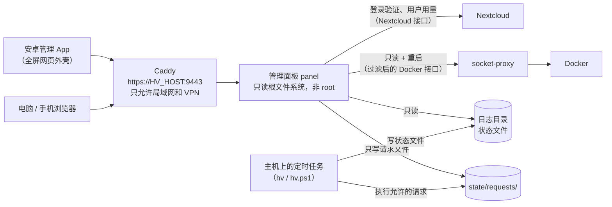

# 10 · 安卓管理 App 与管理面板

HomeVault 带有一个**管理面板**（网页）和一个配套的**安卓管理 App**（应用名"HomeVault 家庭归档"）。用它们可以在手机上查看服务器的运行状态、硬盘用量、备份记录、日志和 VPN 设备，也可以做几件常用操作，比如立即备份、修改日志保留天数、重启某个服务。

这两样东西是**给管理员用的**。家人手机上的照片自动备份仍然由 Nextcloud App 完成（见 [docs/05-安卓手机备份.md](05-安卓手机备份.md)），家人不需要安装管理 App。

相关文档：[docs/01-架构与安全.md](01-架构与安全.md) · [docs/03-Windows部署.md](03-Windows部署.md) · [docs/05-安卓手机备份.md](05-安卓手机备份.md) · [docs/08-日常运维与升级.md](08-日常运维与升级.md)

> 命令写法：Linux 是 `sudo ./hv <命令>`，Windows 是管理员 PowerShell 里的 `.\windows\hv.ps1 <命令>`（Windows 上大部分操作也可以在桌面的"HomeVault 管理"菜单里完成）。下文只写 Linux 的形式。

---

## 1. 它是怎么工作的



```text
 App / 浏览器 ──HTTPS──▶ Caddy :9443 ──▶ 管理面板 ──┬─▶ Nextcloud（登录、用户用量）
                                                  ├─▶ socket-proxy ─▶ Docker（只读 + 重启）
                                                  ├─▶ 日志、状态文件（只读）
                                                  └─▶ state/requests/（只写"请求"）
 主机定时任务（hv / hv.ps1）：写状态文件；执行面板提交的请求（立即备份、清理日志、改保留天数）
```

要点：

- 管理面板是一个很小的服务（服务名 `panel`，Go 语言，只用标准库），**在你自己的电脑上从源码构建**，不从任何镜像仓库下载。它随 HomeVault 一起启动，Linux 和 Windows 都有。
- 它和 Nextcloud 使用**同一个地址**，只是端口不同：`https://HV_HOST:9443`（端口由 `.env` 里的 `HV_PANEL_PORT` 决定，默认 9443）。和 Nextcloud 一样，**只有家里局域网和 VPN 里的设备能打开**。
- 登录用 **Nextcloud 管理员账户**（包括二步验证），只有 Nextcloud `admin` 组的成员能进。
- 面板**不能**直接在主机上执行命令。"立即备份"这类操作，面板只是写一个"请求文件"，由主机上的定时任务检查后执行（见 [§7](#7-安全设计)）。
- 安卓管理 App 只是面板的**手机外壳**：打开的是同一个网页，另外加了几个手机上用得着的按钮（打开 Nextcloud、打开 VPN App 等）。

---

## 2. 打开管理面板

### 2.1 地址

```text
https://HV_HOST:9443
```

`HV_HOST` 就是你访问 Nextcloud 用的地址，例如 IP 模式下的 `https://192.168.1.10:9443`，域名模式下的 `https://cloud.example.com:9443`。安装结束时的总结里会显示"管理面板"地址。

- **Windows：** 双击桌面上的"HomeVault 管理"，在菜单里选 **11 打开管理面板**。
- **在家：** 手机或电脑连着家里的 Wi-Fi / 网线即可打开。
- **在外面：** 先打开 VPN（WG Tunnel 或 WireGuard），和访问 Nextcloud 一样。
- 请使用上面这个**标准地址**：面板只在 `HV_HOST` 这个地址上提供，用别的 IP 或名字（例如 Windows 的 VPN 隧道地址）打不开。

### 2.2 IP 模式：先安装根证书

IP 模式下，浏览器和 App 要先信任 HomeVault 的根证书，否则会提示"连接不是私密连接"或"证书不受信任"。根证书和 Nextcloud 用的是**同一个**，装过一次就不用再装：

- 手机：按 [docs/05-安卓手机备份.md](05-安卓手机备份.md) §3 安装，并核对指纹；
- 电脑：用 `ca` 命令导出后安装到系统的"受信任的根证书颁发机构"（`ca` 命令会显示各系统的安装方法）；
- 面板本身也提供根证书下载：`https://HV_HOST:9443/ca.crt`（只有证书，不含私钥；下载的文件名是 `homevault-ca.crt`）。登录后，**设置**页里会显示它的 SHA-256 指纹，可以用来核对。

域名模式（`HV_TLS_MODE=acme-dns`）使用 Let's Encrypt 正式证书，**不需要**装任何证书。

### 2.3 登录（Nextcloud 管理员 + 二步验证）

1. 打开面板，点 **使用 Nextcloud 登录**。
2. 浏览器会在**新标签页**打开 Nextcloud 的登录页（在管理 App 里则会跳到**手机浏览器**）。
3. 在 Nextcloud 的"连接到您的账号"页面点 **登录**，输入管理员账户、密码和二步验证码，最后在"账号访问"页面点 **授权访问**（英文界面是"Grant access"）。授权页上显示的名称应为"**HomeVault 管理面板（你的 IP）**"。只在你自己刚发起登录时才授权。
4. 回到面板页面（或切回管理 App），几秒内会自动进入。

几点说明：

- **只有 Nextcloud `admin` 组的成员能登录。** 普通家庭成员授权后会被拒绝，面板会立即删除刚创建的设备密码。
- 登录时，Nextcloud 会为面板创建一个设备密码（在 Nextcloud 的 **个人设置 → 安全 → 设备和活动链接** 里能看到）。**退出登录**、会话到期或面板正常停止时，面板会自动删除它。
- 会话有效期 **12 小时**。面板每 5 分钟核对一次：设备密码被删掉了，或者这个账户不再是管理员，会话会立即失效。
- **备用方式：用应用密码登录。** 点"使用应用密码登录"，填 Nextcloud 用户名和一个应用密码（在 Nextcloud 网页 **头像 → 个人设置 → 安全** 页面底部创建）。这个应用密码由你自己管理，退出面板时**不会**被删除，不用了请自己到 Nextcloud 里撤销。
- 登录失败次数有限制（同一 IP 15 分钟内最多 5 次应用密码登录失败）。另外，Nextcloud 自身的暴力破解防护也会按真实来源 IP 生效。

---

## 3. 各页面的功能

面板共有 6 个页面，用手机屏幕底部（电脑上是左侧）的导航栏切换。右上角有 **刷新** 和 **退出登录** 按钮。页面会自动定时刷新，也支持深色模式。

| 页面 | 能看到什么 | 能做什么 |
|---|---|---|
| **概览** | 告警列表（没有问题时显示"一切正常"）；主数据盘用量；上次成功备份时间；VPN 在线设备数；Nextcloud 版本、用户数、文件数；每个服务的运行和健康状态、已运行时间、自动重启次数；服务器信息（HomeVault 版本、平台、Docker 版本、CPU 和内存） | **重启**服务：`app`（Nextcloud）、`cron`、`db`、`redis`、`caddy`、`wg-easy`、`ddns-go`。面板自己和 socket-proxy 不能在这里重启 |
| **存储** | 每块用到的硬盘：角色（主数据 / 扩展存储 / 备份）、名称、路径、总容量、已用、剩余；"备份目标与某个存储在同一块磁盘"的提醒；每个 Nextcloud 用户的用量和配额、最近登录时间；Nextcloud 统计（文件数、数据库大小、活跃用户）；`storage.conf` 里配置的扩展存储 | 只看。增减硬盘请用 `storage` 命令（见 [docs/08-日常运维与升级.md](08-日常运维与升级.md) §6） |
| **备份** | 备份状态（成功 / 部分成功 / 失败 / 进行中）、上次成功和上次运行时间、耗时、备份目标、每日计划时间、新增数据量；最近的"立即备份"请求；最近 60 个 restic 快照 | **立即备份**；**查看备份日志**（跳到日志页里对应的文件）。恢复文件仍需在服务器上用 `restore` 命令 |
| **日志** | 日志保留天数；"日志文件"标签：按类别列出 HomeVault 命令日志、备份日志、Nextcloud 日志、Caddy 访问日志、每日导出的容器日志、面板审计日志；"容器实时日志"标签：每个容器最近的输出 | 修改**日志保留天数**、**立即清理旧日志**；查看某个文件或容器的最后 200–5000 行；搜索；自动刷新（每 5 秒）；自动换行；**下载**日志。`.gz` 压缩文件也能直接看 |
| **VPN** | 每台 VPN 设备的名称、VPN 地址、是否在线（3 分钟内有握手算在线）、最近握手时间、上传 / 下载流量、来源地址 | 只看。添加或删除设备：Linux 用 wg-easy 网页或 `vpn` 命令；Windows 用菜单 **6 添加手机VPN** 或 `vpn add` / `vpn remove` |
| **设置** | 日志保留天数；**安卓应用**下载按钮和二维码；**根证书**（名称、SHA-256 指纹、有效期）和安卓安装步骤；外观（跟随系统 / 浅色 / 深色）；最近提交给主机的请求及结果；关于（版本、当前用户、登录方式、会话到期时间） | 下载 App 和根证书；修改日志保留天数；切换主题；退出登录 |

**概览页可能出现的告警：**

| 告警 | 含义 / 处理 |
|---|---|
| 服务"……"未运行 / 健康检查失败 / 不存在 | 点告警进入日志页查看原因；也可以先点"重启"。一直不好就在服务器上运行 `doctor` |
| "……"剩余空间不足 10% | 清理或扩容，见 [docs/08-日常运维与升级.md](08-日常运维与升级.md) §5 |
| 备份目标与"……"位于同一块磁盘 | 硬盘坏了会同时丢数据和备份，请换一块硬盘做备份 |
| 还没有成功的备份记录 / 上次成功备份已超过 48 小时 / 最近一次备份失败或不完整 | 在备份页点"查看备份日志"找原因，见 [docs/07-备份与恢复.md](07-备份与恢复.md) |
| 有请求超过 15 分钟未被主机处理 | 主机上处理请求的定时任务没在运行，见 [§8](#8-排错) |
| 主机状态文件超过 36 小时未更新 | 每日维护任务没在运行，见 [§8](#8-排错) |

### 3.1 "立即备份""修改保留天数"要等多久

这几个按钮不会立刻生效，而是写一个请求，交给主机执行：

- **Linux：** 通常几秒内开始（`homevault-requests.path` 监视请求目录；另外每 5 分钟还会检查一次）；
- **Windows：** 计划任务 `HomeVault-Requests` 每 2 分钟检查一次，所以最多等 2 分钟左右。

请求状态会显示为"等待主机执行 → 执行中 → 成功 / 失败"。备份开始后，导出数据库时 Nextcloud 会短暂进入维护模式（通常不到 1 分钟），手机上传会稍后自动继续。

### 3.2 日志保留天数

日志保留天数默认 **7 天**，可设 1–365 天。在面板的**日志**页或**设置**页输入天数（或点 3 / 7 / 14 / 30 / 90 天的快捷按钮），点**保存**。主机执行后，每天的维护任务会删除超过这个天数的日志文件。日志的存放位置和其他修改方法见 [docs/08-日常运维与升级.md](08-日常运维与升级.md) §7。

---

## 4. 安装安卓管理 App

**系统要求：** Android 8.0 及以上。华为 HarmonyOS NEXT（纯血鸿蒙）不能安装 APK，请直接用手机浏览器打开面板地址（见 [§6](#6-不装-app-也可以用)）。

### 4.1 获取安装包（任选一种）

**方法 A：从自己的服务器下载（推荐，在家里 Wi-Fi 下最快）**

1. 管理员先在服务器上下载最新安装包到 `state/app/homevault.apk`：

   ```bash
   sudo ./hv android fetch
   ```

   Windows 上是 `.\windows\hv.ps1 android fetch`。它会从 GitHub 上本项目的最新 Release 下载 APK（仓库由 `.env` 里的 `HV_ANDROID_RELEASE_REPO` 指定）。服务器访问不了 GitHub 时，可以在别的电脑上下载好 APK，再用 `--file <本地APK路径>` 导入；也可以用 `--url <APK下载地址>` 指定一个 `https` 下载地址。

2. 用电脑浏览器登录管理面板 → **设置** → "安卓应用"卡片，用手机扫描二维码；或者直接在手机浏览器里打开：

   ```text
   https://HV_HOST:9443/download/android
   ```

   手机必须连着家里 Wi-Fi 或已打开 VPN。IP 模式下请先装好根证书（[§2.2](#22-ip-模式先安装根证书)），否则浏览器可能拦截下载。

**方法 B：从 GitHub Releases 下载**

打开 <https://github.com/yuelanxian/-/releases>，在最新版本里下载 `homevault-android.apk`。同一页上的 `homevault-android.apk.sha256` 是校验值，可以用来核对文件是否完整。

### 4.2 允许"安装未知应用"

管理 App 不在应用市场上架，第一次安装时手机会拦截。这一步和安装 Nextcloud、WG Tunnel 时一样（见 [docs/05-安卓手机备份.md](05-安卓手机备份.md) §1.2）：

1. 在浏览器或文件管理器里点开下载好的 APK；
2. 系统提示"出于安全考虑，已禁止安装未知来源的应用"之类的话时，点**设置**，给**这个浏览器（或文件管理器）**打开"**允许安装未知应用**"，然后返回继续安装。安卓 8.0 起，这个权限是**按 App 单独授予**的，不是全局开关；
3. 各品牌的额外拦截：

| 品牌 | 可能遇到的情况 | 怎么办 |
|---|---|---|
| 小米 / Redmi（HyperOS、MIUI） | 安装前弹出"风险提示"，可能要求等待几秒 | 确认文件来自上面的地址后，选择继续安装 |
| 华为 / 荣耀（EMUI、HarmonyOS 2–4、MagicOS） | 开启了"纯净模式"时会阻止安装 | 在提示里选择继续安装；或者在**设置**里搜索"纯净模式"，临时关闭，装完再打开 |
| OPPO / 一加 / realme（ColorOS 等） | 弹出"未知来源"或"安全检测"提示 | 按提示允许当前浏览器安装应用 |
| vivo / iQOO（OriginOS 等） | 弹出"风险检测"之类的提示 | 选择继续安装 |
| 三星（One UI） | 提示"未知来源" | 按提示给浏览器或"我的文件"打开"安装未知应用" |

各品牌、各系统版本的菜单名称经常变化，上表只是常见情况。找不到时，在**设置**顶部的搜索框里输入"**未知应用**"或"**外部来源**"。

4. 装好后可以删掉下载的 APK 文件；也可以把刚才允许过的浏览器的"安装未知应用"权限关掉。

### 4.3 第一次打开：填写服务器地址

1. 手机连上**家里的 Wi-Fi**（在外面则先打开 VPN）。
2. 打开"**HomeVault 家庭归档**"，在"**管理面板地址**"里填 `https://HV_HOST:9443`，例如 `https://192.168.1.10:9443`。
   - 只接受 `https://` 开头的地址；
   - 没写端口时，App 会自动补上 9443；
   - "Nextcloud 网页地址（可选）"一般留空。Nextcloud 不在 443 端口时需要完整地址（例如 `https://192.168.1.10:8444`）："测试连接"成功时 App 会按服务器的设置自动填好，也可以手动填写。
3. 点 **测试连接**。App 会用和正式访问完全相同的证书规则请求面板的 `/api/info`（只有真正的 HomeVault 管理面板才会回答），并用中文说明结果：

| 结果 | 含义 / 处理 |
|---|---|
| 连接成功，证书有效：这是 HomeVault 管理面板（版本 …） | 可以继续。Nextcloud 不在默认的 443 端口、而"Nextcloud 网页地址"一栏又空着时，App 会按服务器的设置自动填好这一栏，并提示"已按服务器的设置填入 Nextcloud 网页地址" |
| 能连上，但这看起来是 Nextcloud 的地址，不是管理面板 | 填成了 Nextcloud 的地址（443 端口）。改成 9443（或你设置的 `HV_PANEL_PORT`） |
| 能连上，证书也有效，但这个地址不是 HomeVault 管理面板（HTTP …） | 填成了别的服务，例如 Linux 上 8443 的 VPN 管理页。改成 9443 |
| 证书有效，但管理面板暂时没有响应（HTTP 5xx） | 面板或 Nextcloud 正在启动、更新。稍后再试；一直这样就在服务器上运行 `doctor` |
| 无法建立加密连接（…） | 端口不是 HTTPS 端口，或者用的不是安装结束时显示的地址（服务器只为这些 IP / 域名提供证书） |
| 手机还不信任它的证书 | IP 模式没装根证书。点 **证书安装说明**，按提示安装（[§2.2](#22-ip-模式先安装根证书)） |
| 证书与这个地址不匹配 | 填的不是标准地址。改用安装结束时显示的地址 |
| 证书已过期（也请检查手机的日期和时间） | 多半是手机日期时间不对，打开"自动设置日期和时间" |
| 找不到这个域名 / 连接超时 / 无法连接 | 检查拼写；在家确认连的是家里的 Wi-Fi（不是访客网络）；在外面先打开 VPN；确认服务器开着、HomeVault 在运行 |
| 服务器直接断开了连接 | 手机的 IP 不在服务器允许的网段内（`HV_ALLOWED_CIDRS`），或者端口填错了 |
| 连接失败：… | 其他错误，按冒号后面的具体原因排查 |

4. 点 **保存并打开**，然后按 [§2.3](#23-登录nextcloud-管理员--二步验证) 登录。在 App 里点"使用 Nextcloud 登录"后，Nextcloud 登录页会在**手机浏览器**里打开；登录并授权后，**切回 App**，会自动进入面板。

### 4.4 App 顶栏按钮

| 按钮 | 作用 |
|---|---|
| **刷新** | 重新加载面板页面 |
| **文件** | 打开 Nextcloud App（`com.nextcloud.client`）；没装时提示下载，或在浏览器里打开 Nextcloud 网页版 |
| **VPN** | 依次尝试打开 WG Tunnel、官方 WireGuard App；都没装时说明怎么安装和导入配置 |
| **更换服务器**（菜单里） | 重新填写地址；会清除旧服务器的登录状态和缓存 |
| **关于**（菜单里） | 版本号、当前服务器地址 |

- 返回键在面板内后退；面板加载失败时，会显示原因和"重试 / 打开 VPN / 更换服务器"按钮。从 VPN App 切回来时会自动重试。
- 面板里的下载（日志、根证书、安装包）交给系统"下载管理器"完成：Android 10 及以上保存到"下载（Download）"文件夹；Android 8/9 保存到 `Android/data/app.homevault.android/files/Download`。

### 4.5 更新 App

- **从服务器更新：** 管理员运行 `sudo ./hv android fetch` 下载新版本，然后在手机上重新从 **设置** 页下载并安装，直接覆盖即可。
- **从 GitHub 更新：** 到 Releases 页下载新版本，直接覆盖安装。
- 如果安装时提示"**签名不一致 / 与已安装的应用冲突**"：说明新旧两个版本的签名不同（例如项目仓库没有配置正式签名密钥时，每次构建的签名都不一样）。先卸载旧版再安装即可。卸载只会清掉这台手机上保存的服务器地址和登录状态，服务器上的数据不受影响。

---

## 5. 在电脑上使用

电脑浏览器直接打开 `https://HV_HOST:9443` 即可，功能和手机上完全一样。IP 模式下电脑也要安装根证书（`ca` 命令会显示 Windows、macOS、Linux 的安装方法）。

面板带有网页应用清单（PWA）。如果 Chrome、Edge 的地址栏右侧出现"安装"图标，可以把它装成一个独立窗口。

---

## 6. 不装 App 也可以用

管理 App 只是一个外壳，不装也行：

- 在手机浏览器（Chrome、Edge 等）里打开 `https://HV_HOST:9443`，登录后用浏览器菜单里的"**添加到主屏幕**"，效果和 App 差不多；
- **华为 HarmonyOS NEXT** 不能装 APK，就用这种方式。

区别是：浏览器里没有"文件""VPN"这两个快捷按钮；另外，登录时 Nextcloud 登录页会在浏览器的新标签页里打开，授权后请**手动切回面板的标签页**。

---

## 7. 安全设计

面板能看到服务器的很多信息，所以 HomeVault 给它加了好几层限制：

| 层面 | 做法 |
|---|---|
| **谁能访问到** | 和 Nextcloud 一样，只在局域网和 VPN 里能打开：路由器只转发 WireGuard 的 UDP 端口；Caddy 丢弃来自 `HV_ALLOWED_CIDRS` 以外地址的连接；Linux 的主机防火墙（`firewall --apply`）和 Windows 防火墙规则也覆盖面板端口 |
| **谁能登录** | 只有 Nextcloud `admin` 组的成员。登录走 Nextcloud 自己的登录页，所以 Nextcloud 强制的**二步验证**、密码策略、暴力破解防护都照样生效 |
| **凭据怎么保存** | 登录得到的设备密码只保存在面板进程的**内存**里，用来调用 Nextcloud 接口；不写硬盘。退出、过期或面板停止时自动删除 |
| **会话** | Cookie 设置了 HttpOnly、Secure、SameSite=Strict；12 小时过期；所有修改类操作都要带 CSRF 令牌，并拒绝跨站请求；登录有频率限制。会话只保存在面板进程的内存里，面板容器重建或重启后要重新登录 |
| **跨站请求兜底（Caddy）** | 面板（9443）和 wg-easy（8443）前面的 Caddy 另加一道检查：浏览器从其他网站或其他端口发来的修改类请求（POST 等）一律返回 403"跨站请求已拒绝"（依据 `Sec-Fetch-Site`，没有时比较 `Origin`）。wg-easy 自己没有 CSRF 防护，这一层对它尤其重要 |
| **Docker 权限** | 面板容器里**没有** `docker.sock`。它只能通过 `socket-proxy`（linuxserver/socket-proxy）访问 Docker，而 socket-proxy 只放行：查看容器列表和详情、查看日志、查看版本信息、**重启**容器。创建容器、在容器里执行命令（exec）、镜像、卷、网络等一律拒绝。（上游的"允许重启"开关同时也放行停止容器，但面板代码只调用重启。）socket-proxy 和面板之间是一个 `internal: true` 的独立网络 `dockerapi`，别的容器连不上 |
| **重启白名单** | 面板只会重启本项目中的 `app`、`cron`、`db`、`redis`、`caddy`、`wg-easy`、`ddns-go` |
| **文件访问** | 日志目录、各硬盘的统计挂载点（`/stat/...`）、`storage.conf` 都是**只读**挂载；面板对硬盘只读取容量信息，**不读取文件内容**。面板程序只写两个地方：`state/requests/`（请求文件）和 `logs/panel/`（自己的审计日志）；Linux 上的目录权限也只允许它写这两处 |
| **请求文件** | 面板提交的请求只有三种：`backup`（立即备份）、`log-clean`（清理旧日志）、`log-retention`（修改保留天数，1–365）。主机上的执行程序只认这三种，其他内容一律拒绝，并把结果写到 `state/requests/done/` |
| **容器加固** | 非 root 用户（uid 65532）运行；只读根文件系统；去掉所有 Linux capabilities；`no-new-privileges`；端口不直接对外发布，只经过 Caddy |
| **镜像来源** | 面板镜像 `homevault/panel` 在你自己的电脑上用 `panel/Dockerfile` 构建，**从不**从镜像仓库拉取（Docker Hub 上同名的镜像不属于本项目） |
| **不含密钥的状态** | VPN 页的数据来自主机写的 `state/vpn-status.json`，里面只有设备名、VPN 地址、来源地址（设备当时的公网 IP 和端口）、握手时间和流量，没有任何密钥。面板也会丢弃文件里多余的字段 |
| **审计** | 登录、退出、提交请求、重启服务、下载日志都会记录到 `logs/panel/panel.log`（每天一个文件，按日志保留天数清理） |

**面板故意做不到的事：** 创建用户、重置密码、添加 VPN 设备、恢复备份、修改存储、升级。这些操作影响大，仍然只能在服务器上用命令（或 Windows 管理菜单）完成。这样即使管理员的面板会话被人盗用，能造成的破坏也很有限。

**安卓管理 App 的安全设计：**

- 只申请"网络"一个权限，不含任何第三方库；
- 只允许 HTTPS；信任"系统证书 + 用户自己安装的证书"（IP 模式需要后者）；
- 遇到证书错误**一律停止加载**，从不忽略，并用中文说明怎么安装根证书；
- 只有和面板**同源**（协议、主机、端口完全相同）的页面在 App 里打开，其他链接（包括 Nextcloud 登录页）交给手机浏览器；
- 更换服务器时清除 Cookie、网页存储和缓存；不参与系统备份和换机迁移。

⚠️ **手机丢了怎么办：** 面板会话最长 12 小时就会过期；想马上让它失效，到 Nextcloud 网页 **个人设置 → 安全 → 设备和活动链接** 里撤销名为"HomeVault 管理面板（…）"的设备。其余步骤见 [docs/08-日常运维与升级.md](08-日常运维与升级.md) §10。

---

## 8. 排错

| 现象 | 可能原因 | 处理 |
|---|---|---|
| 打不开 `https://HV_HOST:9443`，Nextcloud 却能打开 | 面板容器没运行；端口被防火墙挡住 | 在服务器上运行 `status` 和 `doctor`；`sudo ./hv logs panel` 查看面板日志；Windows 运行 `.\windows\hv.ps1 firewall --apply` 更新防火墙规则 |
| 浏览器提示"连接不是私密连接"；App 提示"证书不受信任" | IP 模式没装根证书，或装错了类型 | 按 [§2.2](#22-ip-模式先安装根证书) 安装，类型选"CA 证书" |
| App 提示"证书与这个地址不匹配" | 用了非标准地址（例如 VPN 地址、另一个 IP） | 改用 `https://HV_HOST:9443` |
| 点"使用 Nextcloud 登录"后，登录页打不开 | 手机浏览器还不信任根证书；在外面没开 VPN | 装好根证书；打开 VPN |
| 授权后提示"只有 Nextcloud 管理员（admin 组成员）可以登录管理面板" | 这个账户不在 `admin` 组 | 用管理员账户登录；或由管理员在 Nextcloud 里把该账户加入 `admin` 组（慎重） |
| 授权后一直停在"正在等待 Nextcloud 登录完成" | 授权页没有点"授权访问"；在别的浏览器里授权了；等待超过了 20 分钟 | 点"重新打开 Nextcloud 登录页"再授权；或点"取消"重新开始；实在不行用"使用应用密码登录" |
| 提示登录次数过多 | 触发了登录频率限制 | 等一会儿再试（页面会提示需要等待的时间） |
| 存储页显示"没有可统计的磁盘" | `compose.storage.yaml` 还没有生成 | 在服务器上运行 `sudo ./hv storage apply` |
| 备份、VPN 页一直没有数据；概览提示"主机状态文件超过 36 小时未更新" | 主机上的定时任务没运行 | Linux：`systemctl list-timers 'homevault-*'` 查看，必要时重新运行 `sudo ./hv install`（不会重新生成密码）；Windows：在"任务计划程序"里检查 `HomeVault-Maintenance` 等任务，见 [docs/03-Windows部署.md](03-Windows部署.md) §7.5 |
| 点了"立即备份"，一直显示"等待主机执行" | 请求处理任务没运行 | Linux：`systemctl status homevault-requests.path`，也可以手动运行 `sudo ./hv requests process`；Windows：检查计划任务 `HomeVault-Requests` |
| "设置"页没有安卓应用下载按钮 | 服务器上还没有安装包 | 运行 `sudo ./hv android fetch` |
| 概览页"服务状态"显示"无法连接 Docker" | `socket-proxy` 没运行 | `sudo ./hv up`；`sudo ./hv logs socket-proxy` |
| 修改了日志保留天数，但页面上还是旧值 | 主机还没执行请求 | 等待片刻后刷新；在"设置"页底部看请求状态 |
| 增删额外存储、更新或重启后，面板要求重新登录 | 面板容器被重建或重启，内存里的会话随之清空 | 正常现象，重新登录即可 |
| 操作时提示"跨站请求已拒绝"（403） | 请求不是从面板页面本身发出的（其他网页、书签脚本、浏览器扩展） | 直接在地址栏打开 `https://HV_HOST:9443` 再操作；必要时关闭相关扩展 |

更多问题见 [docs/09-常见问题.md](09-常见问题.md)。

---

## 来源 / 参考

版本信息截至 2026-09：

- Nextcloud Login Flow v2（`/index.php/login/v2`、轮询、删除应用密码 `DELETE /ocs/v2.php/core/apppassword`）：<https://docs.nextcloud.com/server/latest/developer_manual/client_apis/LoginFlow/index.html>
- Nextcloud OCS 用户接口（用户列表、用量与配额、组成员）：<https://docs.nextcloud.com/server/latest/admin_manual/configuration_user/instruction_set_for_users.html>
- Nextcloud 设备与会话 / 应用密码：<https://docs.nextcloud.com/server/latest/user_manual/en/session_management.html>
- linuxserver/socket-proxy（`CONTAINERS`、`ALLOW_RESTARTS`、`POST` 等开关）：<https://github.com/linuxserver/docker-socket-proxy>
- Docker Engine API：<https://docs.docker.com/reference/api/engine/>
- Go `net/http` 跨站请求防护（`CrossOriginProtection`）：<https://pkg.go.dev/net/http#CrossOriginProtection>
- 安卓网络安全配置（信任用户安装的 CA 证书）：<https://developer.android.com/privacy-and-security/security-config>
- 安卓"安装未知应用"权限（Android 8.0 起按应用授予）：<https://developer.android.com/distribute/marketing-tools/alternative-distribution>
- 安卓 WebView：<https://developer.android.com/develop/ui/views/layout/webapps/webview>
- systemd path 单元（监视请求目录）：<https://www.freedesktop.org/software/systemd/man/latest/systemd.path.html>
- 本项目安卓端说明：[android/README.md](../android/README.md)；管理面板接口约定：[panel/INTEGRATION.md](../panel/INTEGRATION.md)
